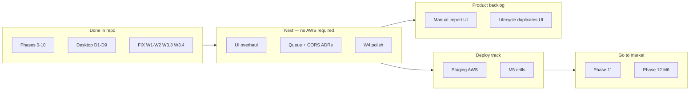

# EDI Data Hub — Master Build Plan & Roadmap

**Owner:** Keagan  
**Last updated:** 2026-06-25  
**Status:** Phases **0–10 code-complete** in the repo. **Path A-core remediation** (FIX_PLAN W1–W2, W3.3, W3.4) complete. **Production deploy and first external customer** not yet done.

> **This file is the single source of truth** for product direction, phase status, and what to build next. Detailed operator checklists, security sign-off, and historical sprint plans remain in linked documents (see [§ Document index](#document-index)). Those files are drill-down references — not parallel roadmaps.

---

## Current snapshot

| Area | Status |
|---|---|
| **Code phases** | 0–10 ✅ code-complete; Desktop track D1–D9 ✅ substantially complete |
| **Milestones in code** | M1 (real) · M2 (lifecycle) · M3 (alerting) · M4 (sellable) · M5 (ops-ready) |
| **Automated tests** | **378** total — 46 `@edi/db` · 46 `@edi/edi-parser` · 227 `@edi/api` · 38 `@edi/web` · 21 `@edi/desktop` |
| **CI** | `npm run typecheck` · `npm run lint` (0 warnings) · `npm run test:ci` — all green |
| **Repo** | Git + GitHub Actions; monorepo with `api` / `web` / `desktop` / `edi-parser` / `db` / `shared` |
| **Local dev** | `docker-compose` (Postgres + MinIO + SFTP); Clerk optional (dev-fallback pins pilot tenant) |
| **Production** | Not deployed — operator work in `ops/PRE_PRODUCTION_TODO.md` |
| **Commercial** | Phase 11–12 not started |

**What “code-complete” does not mean:** Terraform applied, Clerk live keys wired, ECS scheduled tasks running, restore drill completed, or k6 baseline recorded. M5 is reached *in code* only until `ops/PRE_PRODUCTION_TODO.md` is signed off.

---

## North Star (do not drift)

Build an EDI observability platform that **ingests inbound and outbound EDI transactions, decomposes them into structured data, and presents a single hub** for monitoring, searching, troubleshooting, and alerting.

**North Star feature:** *Transaction lifecycle stitching* — pull up a PO number and see the 850, 855, 856, 810, and all 997s in one chronological, status-aware view.

**Anti-drift rule:** Before adding any feature not on this roadmap, write one sentence explaining how it serves monitoring, troubleshooting, alerting, or stability. If you can't, it waits.

---

## Where we are → where we're going



### Ordered next steps

Work top to bottom. Items at the same number can run in parallel only when they don't block each other.

| # | Workstream | Objective | Detail doc | Needs AWS? |
|---|---|---|---|---|
| **1** | ~~Path A-core remediation~~ | Production-safety guardrails + green CI | `FIX_PLAN.md` | No — **✅ done** |
| **2** | UI overhaul | Lifecycle + alerts readable in &lt;30s | `PHASE_UI_PLAN.md` (gates A/B/C) | No |
| **3** | Architecture ADRs | Document actual queue + CORS design | `FIX_PLAN.md` W3.1, W3.2 | No |
| **4** | Polish | Webhook reconcile, raw-file auth URL, parser scope docs | `FIX_PLAN.md` W4.x | No |
| **5** | Manual import UI | In-app multi-file EDI upload (ops role) | Backlog § below | No |
| **6** | Lifecycle duplicates | Show multiple same-type docs on one PO | Backlog § below | No |
| **7** | Staging deploy | HTTPS API + RDS + S3 + Clerk staging | `ops/PATH_A_SPRINT_PLAN.md` A1 · `ops/PRE_PRODUCTION_TODO.md` | **Yes** |
| **8** | Operational proof | Restore drill, k6 baseline, runbook cold-read → M5 in prod | `ops/PATH_A_SPRINT_PLAN.md` A2 | **Yes** |
| **9** | Phase 11 | Stripe, onboarding, legal, marketing | § Phase 11 below | Partial |
| **10** | Phase 12 | First external paying customer (M6) | § Phase 12 below | — |

**Deferred until deploy week:** Sprint A1 (AWS + Clerk secrets gathering) intentionally waits until Path A-core and UI gates are resolved — see `ops/PATH_A_SPRINT_PLAN.md`.

---

## Path A-core remediation (FIX_PLAN) — status

Audit-driven fixes from the 2026-06-22 codebase review. Full root-cause detail stays in `FIX_PLAN.md`.

| Item | Severity | Status | Summary |
|---|---|---|---|
| **W1.1** | Critical | ✅ | Production boot fails if Clerk secrets blank; dev-fallback blocked in prod |
| **W1.2** | Critical | ✅ | ISA dedup scoped to `(tenantId, isaControlNumber)` |
| **W2.1** | High | ✅ | Detection runs for all active tenants (`runDetectionForAllTenants`) |
| **W2.2** | High | ✅ | Lint green with `--max-warnings 0` |
| **W2.3** | High | ✅ | CI runs `test:ci` (db → parser → api → web → desktop) |
| **W3.3** | Medium | ✅ | `requireTenantId()` throws in production when context missing |
| **W3.4** | Medium | ✅ | `clerk-nextjs/` removed from repo; `.gitignore` guard added |
| **W3.1** | Medium | ⏳ | Reconcile BullMQ docs vs cron/sync ingestion — pick Option A or B, write ADR |
| **W3.2** | Medium | ⏳ | CORS decision for split-origin prod — document + implement if needed |
| **W4.1** | Low | ⏳ | `reconcile-clerk.ts` for out-of-order webhook delivery |
| **W4.2** | Low | ⏳ | Raw file viewing via authenticated fetch, not bare URL |
| **W4.3** | Low | ⏳ | Parser scope docs (860/875/880) aligned with `CLAUDE.md` |

---

## Phase completion map

| Phase | Milestone | Status | What exists |
|---|---|---|---|
| **0** — Scaffolding | — | ✅ | Monorepo, TypeScript, ESLint/Prettier, GitHub Actions CI, `docker-compose` |
| **1** — Ingestion | — | ✅ | Upload + SFTP + AS2 channels; S3/MinIO raw storage; ISA dedup; `/health` |
| **2** — Parser | — | ✅ | `@edi/edi-parser`; envelope + 850/810 typed; semantic labels; deviation tolerance |
| **3** — Data Hub UI | **M1** | ✅ | Transaction list/detail, raw-vs-parsed, search, partners |
| **4** — Lifecycle | **M2** | ✅ | PO stitching (850/855/856/810/997); gaps surfaced; `LifecyclePage` |
| **5** — Ack intelligence | — | ✅ | AK/IK decoder; rejection rates; ack linkage on transactions |
| **6** — Partner config | — | ✅ | SLA windows, supported sets, escalation contacts |
| **7** — Monitoring | **M3** | ✅ | Missing-ack + rejection-spike detection; email/Slack; alerts UI |
| **8** — Outbound + AS2 | — | ✅ | Outbound stages; AS2 via OpenAS2; channel registry |
| **9** — Multi-tenant | **M4** | ✅ | Tenant context + Prisma extension; RBAC; audit; Clerk; secrets |
| **10** — Production ops | **M5** *code* | ✅ | Retention, rate limits, metrics, backups, k6 harness, runbooks |
| **UI overhaul** | — | 📝 | Gates open — `PHASE_UI_PLAN.md` |
| **11** — Commercialization | — | ⏳ | Not started |
| **12** — External pilot | **M6** | ⏳ | Not started |
| **Desktop track** | — | ✅ | Electron app, SQLite dev + Postgres installer, auto-update |

---

## Active workstreams (detail)

### UI overhaul (Sprint A3)

**Blocker:** Resolve `PHASE_UI_PLAN.md` gates **A** (accent), **B** (dark mode), **C** (component library). Defaults: A1 indigo, B1 light-only, C1 shadcn on Lifecycle + Alerts only.

**In scope:** Lifecycle timeline readability, alerts triage, transaction list polish, partners SLA clarity.

**Out of scope:** Marketing site, desktop chrome, net-new features outside Phases 0–10.

**Exit:** Keagan spots a missing 856 on a PO in &lt;30s; triages top 5 alerts in ≤2 clicks each.

### Architecture decisions (W3.1 + W3.2)

**W3.1 — Async queue:** Documented design says BullMQ; reality is sync ingestion + cron detection. Choose:
- **Option A:** Add BullMQ + Redis (durable parse queue, worker scaling).
- **Option B:** Keep sync pipeline; add startup reconcile for `RECEIVED` rows never parsed.

Record choice in an ADR; update `CLAUDE.md`.

**W3.2 — CORS:** Decide same-origin (reverse proxy) vs split-origin (`app.` / `api.`). If split-origin, add `@fastify/cors` with config-driven allowlist.

### Product backlog (post-remediation, pre-AWS)

These serve monitoring/troubleshooting and were identified after pilot use:

**Manual import (MI)** — Backend `POST /ingest/upload` exists (ops role). Web Ingestions page is read-only. Build multi-file upload UI with progress, error surfacing, and link to raw file / transaction on success.

**Lifecycle duplicates (LD)** — Multiple invoices or ASNs on one PO are valid. Backend `services/lifecycle.ts` already returns all linked transactions; UI should show every same-type document (not collapse to one) and raw-inline viewing where helpful.

### Deploy track (Sprint A1 → A2)

Operator-owned. Agent prepares Terraform/docs; Keagan runs `terraform apply`, Clerk dashboard, drills.

| Sprint | Goal | Checklist |
|---|---|---|
| **A1** | Staging environment live | `ops/PRE_PRODUCTION_TODO.md` § Infrastructure · `CLERK_SETUP.md` · `infra/README.md` |
| **A2** | M5 proven in production | Restore drill → `ops/RESTORE_LOG.md` · k6 → `ops/load/baseline.md` · `SECURITY_CHECKLIST.md` sign-off |

Local dev (no AWS):

```bash
npm run infra:up
npm run db:migrate
npm run dev:api
npm run dev:web
```

---

## Phase 11 — Commercialization

**Blocker:** Resolve **Gate 4** — self-serve (Stripe checkout) vs direct/contract sales.

**Also resolve before selling:** BUILD_PLAN open questions **Q7** (data rights / employer IP) and **Q11** (business entity).

**Scope:** Subscription tiers, self-serve onboarding, customer-facing docs, marketing/landing site, ToS / Privacy / DPA.

---

## Phase 12 — First external customer (M6)

Recruit 1–2 non-employer design partners → structured feedback → first paid contract.

**Milestone M6 — In market.**

---

## Milestone summary

| Milestone | After | Proves |
|---|---|---|
| **M1 — It's real** | Phase 3 | Real transactions visible and searchable |
| **M2 — Core value** | Phase 4 | Lifecycle view — the actual product |
| **M3 — Internal MVP** | Phase 7 | Monitoring + alerting for pilot |
| **M4 — Sellable** | Phase 9 | Multi-tenant, RBAC, audit — safe for another company |
| **M5 — Production-ready** | Phase 10 + A2 drills | Survivable, recoverable, operable by non-author |
| **M6 — In market** | Phase 12 | Paying external customer |

---

## Desktop track

Parallel delivery vehicle for local-first / on-prem segment. Substantially complete (D1–D9): Electron shell, dual DB provider, filesystem raw storage, local auth, auto-update.

**Polish deferred:** Client update sequence hardening — see `DESKTOP_SPRINT_PLAN.md` OPTIONAL-D2 and `apps/desktop/UPDATE_SCORECARD.md`.

Detail: `DESKTOP_PLAN.md` · sprint history: `DESKTOP_SPRINT_PLAN.md`

---

## Guiding principles

1. **De-risk parsing early** — real-world EDI deviates from spec; fail gracefully, keep raw files.
2. **Every phase ends demoable** — tangible wins sustain momentum.
3. **Single-tenant value before multi-tenant complexity** — pilot first; Phase 9 retrofit done.
4. **Raw file is sacred** — store verbatim before parse; S3 key is primary reference.
5. **Passive observability** — hub receives copies, never sits in live transmission path.

---

## Tech stack (locked)

| Layer | Choice |
|---|---|
| Frontend | React + Vite, Tailwind, shadcn/ui |
| Backend | Node.js + Fastify, TypeScript |
| Database | PostgreSQL via Prisma (SQLite for desktop local dev) |
| Raw storage | S3 / MinIO / local filesystem (desktop) |
| Background jobs | Cron / Task Scheduler today; BullMQ deferred (W3.1) |
| Auth | Clerk (SaaS); local accounts (desktop) |
| Infra | AWS (ECS, RDS, S3, SES, Secrets Manager); Terraform |
| CI/CD | GitHub Actions |

---

## Explicitly out of scope for v1

- VAN / transmission capability
- Mapping/translation editor
- Direct ERP connectors
- Deduction/chargeback workflows
- Sitting in the live transmission path

---

## Deferred-not-rejected (future index)

Living list — sprint plans explain *why*; this section is the index.

- **BullMQ + Redis scheduler** — when sub-minute cadence or queue observability justifies Redis
- **Per-tenant `OUR_ISA_IDS`** — replace global env var (may be done; verify at deploy)
- **Richer escalation contacts** — phone, Slack handles, on-call rotations
- **Calendar-aware SLAs** — business hours, holidays
- **Stale-traffic alert** — partner silent &gt; 2× highest SLA
- **PagerDuty / Opsgenie** — beyond email + Slack
- **999 IK3/IK4 deep parsing** — when 5010 partner needs it
- **Parser sets 860/875/880** — document or gate (W4.3)
- **SOC 2 / external pen test** — when regulated buyer requires

---

## Open questions (unresolved)

| # | Question | Blocks |
|---|---|---|
| Q7 | Cleared to use employer EDI data for personally-owned product? | Phase 11 |
| Q11 | Business entity formed? | Phase 11 |
| Gate 4 | Self-serve vs direct sales? | Phase 11 |

---

## Document index

| Document | Role | Superseded by BUILD_PLAN? |
|---|---|---|
| **`BUILD_PLAN.md`** (this file) | Master roadmap & status | — |
| **`FIX_PLAN.md`** | Remediation audit detail (W1–W4) | Status column here; detail retained |
| **`ops/PATH_A_SPRINT_PLAN.md`** | Deploy sprint steps (A1–A5) | Sequencing here; operator steps retained |
| **`ops/PRE_PRODUCTION_TODO.md`** | Operator checklist (credentialed work) | Active — not superseded |
| **`SECURITY_CHECKLIST.md`** | Phase 9 security sign-off | Active — not superseded |
| **`PHASE_UI_PLAN.md`** | UI overhaul gates + sprint A3 detail | Gates referenced here |
| **`PHASE_10_SPRINT_PLAN.md`** | Phase 10 historical sprint plan | Phase 10 ✅ — reference only |
| **`DESKTOP_PLAN.md`** | Desktop architecture | Desktop section here |
| **`DESKTOP_SPRINT_PLAN.md`** | Desktop D1–D9 sprint history | Reference only |
| **`CLERK_SETUP.md`** | Clerk dashboard wiring | Active operator guide |
| **`CLAUDE.md`** | Agent coding conventions | Active — not a roadmap |
| **`ops/RUNBOOKS.md`** | Incident response | Active operator guide |
| **`ops/SUPPORT.md`** | Support escalation | Active |
| **`docs/EDI_DEVIATIONS.md`** | Parser deviation catalog | Active reference |
| **`infra/README.md`** | Terraform + smoke tests | Active operator guide |

**Removed / never merged:** `clerk-nextjs/` reference repo (W3.4). Planned docs for manual import and lifecycle duplicates live in this backlog until written to `ops/`.

---

## Risk register (abbreviated)

| Risk | Mitigation |
|---|---|
| Real EDI deviates from spec | Parser tested early; raw always stored; graceful failure |
| Cross-tenant data leak | Prisma extension + isolation tests + production `requireTenantId` throw |
| Production auth misconfig | Boot guard + `AUTH_MISCONFIGURED` in prod |
| Scope creep | Anti-drift rule |
| Deploy stall | Path A-core first; AWS deferred until deliberate deploy week |

---

## Commands

```bash
npm install                    # from repo root
npm run typecheck
npm run lint
npm run test:ci                # db → parser → api → web → desktop
npm run dev:api
npm run dev:web
npm run db:migrate --workspace=@edi/db
npm run infra:up               # Postgres + MinIO + SFTP
```
