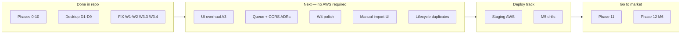

# EDI Data Hub — Build Plan & Roadmap

**Owner:** Keagan  
**Last updated:** 2026-06-25  
**Status:** Phases **0–10 code-complete** in the repo. **Path A-core remediation** (FIX_PLAN W1–W2, W3.3, W3.4) complete. **Production deploy and first external customer** not yet done.

> **This is the only planning document.** All product planning, operator checklists, security sign-off, remediation items, deploy steps, Clerk setup, UI gates, Phase 10 detail, and desktop track plans live in this file. Former standalone files (`CLERK_SETUP.md`, `DESKTOP_PLAN.md`, etc.) are redirect stubs — edit here only.

---

## Table of contents

1. [Current snapshot](#1-current-snapshot)
2. [North Star & guiding principles](#2-north-star--guiding-principles)
3. [Roadmap — where we are and what's next](#3-roadmap--where-we-are-and-whats-next)
4. [Phase & milestone map](#4-phase--milestone-map)
5. [Tech stack & scope boundaries](#5-tech-stack--scope-boundaries)
6. [Product backlog](#6-product-backlog)
7. [UI overhaul (Sprint A3)](#7-ui-overhaul-sprint-a3)
8. [Phase 10 — production readiness (code + operator proof)](#8-phase-10--production-readiness-code--operator-proof)
9. [Path A — deploy track (A1 staging → A2 M5 → A3–A5)](#9-path-a--deploy-track-a1-staging--a2-m5--a3a5)
10. [Pre-production operator checklist](#10-pre-production-operator-checklist)
11. [Clerk setup (Phase 9)](#11-clerk-setup-phase-9)
12. [Security checklist (Phase 9 sign-off)](#12-security-checklist-phase-9-sign-off)
13. [Remediation plan (FIX_PLAN audit)](#13-remediation-plan-fix_plan-audit)
14. [Desktop track — architecture plan](#14-desktop-track--architecture-plan)
15. [Desktop track — sprint plan (D1–D9)](#15-desktop-track--sprint-plan-d1d9)
16. [Phase 11 & 12 — commercialization & first customer](#16-phase-11--12--commercialization--first-customer)
17. [Deferred features, open questions & risks](#17-deferred-features-open-questions--risks)
18. [Commands](#18-commands)

---

## 1. Current snapshot

| Area | Status |
|---|---|
| **Code phases** | 0–10 ✅ code-complete; Desktop track D1–D9 ✅ substantially complete |
| **Milestones in code** | M1 (real) · M2 (lifecycle) · M3 (alerting) · M4 (sellable) · M5 (ops-ready, code only) |
| **Automated tests** | **378** total — 46 `@edi/db` · 46 `@edi/edi-parser` · 227 `@edi/api` · 38 `@edi/web` · 21 `@edi/desktop` |
| **CI** | `npm run typecheck` · `npm run lint` (0 warnings) · `npm run test:ci` — all green |
| **Repo** | Git + GitHub Actions; monorepo |
| **Local dev** | `docker-compose` (Postgres + MinIO + SFTP); Clerk optional (dev-fallback) |
| **Production** | Not deployed — see [§10 Pre-production checklist](#10-pre-production-operator-checklist) |
| **Commercial** | Phase 11–12 not started — see [§16](#16-phase-11--12--commercialization--first-customer) |

**What "code-complete" does not mean:** Terraform applied, Clerk live keys wired, ECS scheduled tasks running, restore drill completed, or k6 baseline recorded. M5 is reached *in code* only until [§10 Phase 10 exit checklist](#phase-10-exit-checklist-m5--production-ready) is signed off.

---

## 2. North Star & guiding principles

Build an EDI observability platform that **ingests inbound and outbound EDI transactions, decomposes them into structured data, and presents a single hub** for monitoring, searching, troubleshooting, and alerting.

**North Star feature:** *Transaction lifecycle stitching* — pull up a PO number and see the 850, 855, 856, 810, and all 997s in one chronological, status-aware view.

**Anti-drift rule:** Before adding any feature not on this roadmap, write one sentence explaining how it serves monitoring, troubleshooting, alerting, or stability. If you can't, it waits.

**Guiding principles:**

1. **De-risk parsing early** — real-world EDI deviates from spec; fail gracefully, keep raw files.
2. **Every phase ends demoable** — tangible wins sustain momentum.
3. **Single-tenant value before multi-tenant complexity** — pilot first; Phase 9 retrofit done.
4. **Raw file is sacred** — store verbatim before parse; object key is primary reference.
5. **Passive observability** — hub receives copies, never sits in live transmission path.

---

## 3. Roadmap — where we are and what's next



### Ordered next steps

| # | Workstream | Status | Section |
|---|---|---|---|
| 1 | Path A-core remediation (W1–W2, W3.3, W3.4) | ✅ Done | [§13](#13-remediation-plan-fix_plan-audit) |
| 2 | UI overhaul — resolve gates A/B/C, then implement | ⏳ Next | [§7](#7-ui-overhaul-sprint-a3) |
| 3 | Architecture ADRs (W3.1 queue, W3.2 CORS) | ⏳ | [§13 W3.1/W3.2](#workstream-w3--medium-architecture-drift--deployment-correctness) |
| 4 | Polish (W4.1–W4.3) | ⏳ | [§13 W4](#workstream-w4--low--polish) |
| 5 | Manual import UI | ⏳ Backlog | [§6](#6-product-backlog) |
| 6 | Lifecycle duplicates UI | ⏳ Backlog | [§6](#6-product-backlog) |
| 7 | Staging deploy (Sprint A1) | ⏳ Needs AWS | [§9 A1](#sprint-a1--staging-environment-deferred) |
| 8 | Operational proof → M5 in prod (Sprint A2) | ⏳ | [§10 exit checklist](#phase-10-exit-checklist-m5--production-ready) |
| 9 | Phase 11 commercialization | ⏳ | [§16](#16-phase-11--12--commercialization--first-customer) |
| 10 | Phase 12 external pilot (M6) | ⏳ | [§16](#16-phase-11--12--commercialization--first-customer) |

**Deferred until deploy week:** Sprint A1 intentionally waits until UI gates are resolved and you schedule a secrets-gathering session.

---

## 4. Phase & milestone map

| Phase | Milestone | Status | Summary |
|---|---|---|---|
| 0 — Scaffolding | — | ✅ | Monorepo, CI, docker-compose |
| 1 — Ingestion | — | ✅ | Upload + SFTP + AS2; S3/MinIO; ISA dedup |
| 2 — Parser | — | ✅ | Envelope + typed 850/810; semantic labels |
| 3 — Data Hub UI | **M1** | ✅ | List, detail, raw/parsed, search |
| 4 — Lifecycle | **M2** | ✅ | PO stitching; gaps surfaced |
| 5 — Ack intelligence | — | ✅ | AK/IK decoder; rejection rates |
| 6 — Partner config | — | ✅ | SLA windows, supported sets |
| 7 — Monitoring | **M3** | ✅ | Missing-ack + spike detection; alerts |
| 8 — Outbound + AS2 | — | ✅ | Outbound stages; OpenAS2 |
| 9 — Multi-tenant | **M4** | ✅ | Tenant extension, RBAC, audit, Clerk |
| 10 — Production ops | **M5** *code* | ✅ code / ⏳ deploy | Retention, rate limits, metrics, backups, runbooks |
| UI overhaul | — | 📝 | [§7](#7-ui-overhaul-sprint-a3) |
| 11 — Commercialization | — | ⏳ | [§16](#16-phase-11--12--commercialization--first-customer) |
| 12 — External pilot | **M6** | ⏳ | [§16](#16-phase-11--12--commercialization--first-customer) |
| Desktop track | — | ✅ | [§14–§15](#14-desktop-track--architecture-plan) |

| Milestone | Proves |
|---|---|
| **M1** | Real transactions visible and searchable |
| **M2** | Lifecycle view — the actual product |
| **M3** | Monitoring + alerting for pilot |
| **M4** | Multi-tenant, RBAC, audit — sellable |
| **M5** | Survivable, recoverable, operable by non-author |
| **M6** | Paying external customer |

---

## 5. Tech stack & scope boundaries

| Layer | Choice |
|---|---|
| Frontend | React + Vite, Tailwind, shadcn/ui |
| Backend | Node.js + Fastify, TypeScript |
| Database | PostgreSQL via Prisma (SQLite for desktop local dev) |
| Raw storage | S3 / MinIO / local filesystem (desktop) |
| Background jobs | Cron / Task Scheduler today; BullMQ deferred ([§13 W3.1](#w31--reconcile-the-async-queue-architecture-with-reality)) |
| Auth | Clerk (SaaS); Clerk on desktop LAN server |
| Infra | AWS + Terraform |
| CI/CD | GitHub Actions |

**Explicitly out of scope for v1:** VAN/transmission, mapping editor, ERP connectors, chargeback workflows, sitting in live transmission path.

**Operational docs (not planning — stay separate):** `ops/RUNBOOKS.md`, `ops/SUPPORT.md`, `ops/RESTORE_LOG.md`, `ops/load/`, `infra/README.md`, `docs/EDI_DEVIATIONS.md`, `CLAUDE.md` (agent conventions).

---

## 6. Product backlog

Post-remediation features that serve monitoring/troubleshooting:

### Manual import (MI)

Backend `POST /ingest/upload` exists (ops role). Web Ingestions page is read-only. Build multi-file upload UI with progress, error surfacing, and link to raw file / transaction on success.

### Lifecycle duplicates (LD)

Multiple invoices or ASNs on one PO are valid. Backend `services/lifecycle.ts` already returns all linked transactions. UI must show every same-type document (not collapse to one) and raw-inline viewing where helpful.

---


---

## 7. UI overhaul (Sprint A3)

**Status:** Draft — decision gates open  
**Scope rule (anti-drift):** Every change must improve **monitoring, troubleshooting, or alerting** readability — especially lifecycle stitching and alerts. No theming for itsing's sake.

**Prerequisite:** Sprint A2 complete (staging operational) is recommended so UI work can be validated against real data.

---

## Decision gates (resolve before coding)

Reply with your choices (or accept defaults) to unblock Sprint A3.

### Gate A — Accent / brand color

| Option | Description |
|--------|-------------|
| **A1 (default)** | Keep current indigo/slate (`#818cf8` accent) — matches desktop update splash |
| **A2** | Teal accent for "ops dashboard" feel (`#14b8a6`) |
| **A3** | Custom — provide hex |

**Recommendation:** **A1** — zero migration risk; focus effort on layout/data density.

### Gate B — Dark mode

| Option | Description |
|--------|-------------|
| **B1 (default)** | Light mode only for v1 overhaul |
| **B2** | Light + dark toggle (system preference) |
| **B3** | Dark default for ops users |

**Recommendation:** **B1** — ship readability wins first; dark mode is a second pass.

### Gate C — Component library

| Option | Description |
|--------|-------------|
| **C1 (default)** | Continue Tailwind + existing patterns; add shadcn/ui primitives only where they replace hand-rolled tables/dialogs |
| **C2** | Full shadcn/ui adoption across all pages |
| **C3** | No new components — CSS/layout only |

**Recommendation:** **C1** — shadcn for data tables, dialogs, and toasts on Lifecycle + Alerts pages only.

---

## In-scope pages (priority order)

1. **Lifecycle view** — PO timeline: status chips, gap callouts, ack errors inline, chronological scan in &lt;10s  
2. **Alerts list + detail** — SLA context, partner name, ack link, snooze/ack actions obvious  
3. **Transaction list** — denser filters, saved URL state (already exists — polish only)  
4. **Partners config** — read-only clarity for SLA windows (no new config surface)

## Out of scope

- Marketing / landing site (Phase 11)  
- Desktop Electron chrome  
- New features not in BUILD_PLAN Phases 0–10  

---

## Sprint A3.1 — Lifecycle readability

**Deliverables:**

- Timeline component: each doc type (850/855/856/810/997) with consistent status color + timestamp  
- "Missing expected document" gaps styled as warnings, not empty errors  
- 997 rejection summary expandable inline (AK3/AK4 plain English from ack-decoder)  
- Playwright snapshot update for `lifecycle-view.spec.ts`

**Exit criteria:** Keagan can find a PO's full chain and spot a missing 856 in under 30 seconds on pilot data.

## Sprint A3.2 — Alerts readability

**Deliverables:**

- Alert row: partner, type, age vs SLA, deep link to lifecycle or transaction  
- Bulk ack/snooze patterns if ops uses them daily (only if pilot confirms need)  
- Empty state when no alerts  

**Exit criteria:** Pilot user can triage top 5 alerts without opening more than 2 extra clicks each.

---

## Technical notes

- Stack: React + Vite + Tailwind (`apps/web`)  
- Tests: existing Vitest + Playwright parity (`apps/web/test`, `apps/desktop/test/parity`)  
- No API schema changes unless a display field is missing — prefer computed UI from existing endpoints  

---

## How to unblock

Post your gate choices, e.g.:

```
Gate A: A1
Gate B: B1
Gate C: C1
```

Defaults above apply if you say "use defaults."

---

## 8. Phase 10 — production readiness (code + operator proof)

**Phase goal:** Make the system survivable in the real world. Before Phase
10 the app boots, accepts traffic, and is secure (Phase 9). After Phase 10
it can be operated by a person who isn't the author — logs are searchable,
metrics are alertable, backups have been restored at least once, and an
incident runbook exists.

**Exit criteria (= BUILD_PLAN Phase 10 exit):**
- Load test passes at projected volume (numeric target picked in Sprint 5).
- Backup restore drilled end-to-end in staging (not just "backups exist").
- Data retention enforced for raw files, audit events, and alerts.
- Rate limiting + size limits in place on the public API.
- Written incident runbooks for the top failure modes.

**Estimated effort:** 2–4 weeks at 15–25 hrs/week. Smaller than Phase 9
because the code volume is lower, but the verification cycles (drilling a
restore, running a load test, walking through a runbook) are wall-clock
heavy.

**Milestone reached:** M5 — Production-ready.

**Builds on:**
- Phase 8 channel registry (health reporting per channel).
- Phase 9 secrets loader (rate-limit + backup-restore credentials live there).
- Phase 9 audit log (retention policy lands here).

---

## Locked decision gates (defaults below; override if needed)

| Gate | Default | Why |
|---|---|---|
| **A — Metrics backend** | Prometheus scrape endpoint on the API (`/internal/metrics`), Grafana for dashboards. | Open-source, single binary; cheap to host on the existing VPC. CloudWatch is the alternative — pick it only if you want one fewer thing to operate. |
| **B — Log aggregation** | CloudWatch Logs (the ECS task driver ships stdout there for free). | Zero extra infra; pgaudit / Loki are deferrable. |
| **C — Backup cadence** | RDS automated snapshots daily (already on from Phase 9 Sprint 5) + one weekly logical `pg_dump` to a separate S3 bucket. | Two-layer protection: snapshot for fast restore, logical dump for cross-region disaster recovery. |
| **D — Rate-limit strategy** | Token bucket per (tenant, route group), in-memory per task with sticky sessions disabled. Redis-backed when traffic justifies. | In-memory is good enough for v1; Redis is a Sprint-7 problem. |
| **E — Load-test target** | 100 req/s sustained at p95 < 500 ms for read endpoints; 10 ingestions/s at p95 < 2 s. Pilot's actual traffic is ~5 req/s; we're sizing for headroom. | Numbers based on the pilot's observed volume × 20. Revisit when the first external customer signs. |

---

## What changes vs. Phase 9

| Layer | Today (Phase 9) | Phase 10 adds |
|---|---|---|
| **Logging** | Fastify pino at `info` to stdout. | Structured request logs (`reqId`, `tenantId`, `route`, `latencyMs`, `outcome`). CloudWatch log group with retention. |
| **Metrics** | None on the app itself. | `prom-client` exposing request count / latency histogram / channel health / queue depth (when BullMQ lands). `/internal/metrics` scrapable from inside the VPC. |
| **Health** | `/health` returns 200 + DB/S3/channel status. | Add `/readiness` (separate from liveness): returns 200 only when the API has fully booted (DB schema migrated, channels started). The ALB target group uses `/readiness`; ECS uses `/health` for liveness. |
| **Backups** | RDS automated snapshots (Phase 9 Sprint 5). | Documented restore runbook + a quarterly restore drill recorded in `ops/RESTORE_LOG.md`. Weekly logical `pg_dump` → separate S3 bucket with object lock. |
| **Retention** | None — every raw file + audit row lives forever. | Configurable per-table retention. Default: raw files 18 months, parsed tree 18 months, audit events 365 days (deferred-delete to 730), alerts 365 days. |
| **Rate limiting** | None. | `@fastify/rate-limit` on the public surface. Per-tenant buckets; the `/ingest/upload` route gets a separate, tighter bucket. |
| **Load testing** | None. | `ops/load/k6/` scripts that hit the staging API. Baseline run committed to `ops/load/baseline.md`. |
| **Incident response** | None written. | `ops/RUNBOOKS.md` covering: DB down, S3 unreachable, ingestion queue backed up, Clerk webhook drift, tenant deletion request. |

---

## Pre-sprint architecture decisions

| Question | Decision | Reason |
|---|---|---|
| Where do incident runbooks live? | `ops/RUNBOOKS.md` (single file in the repo). | One Cmd-F to find anything; PR review keeps them current. |
| What format are metrics in? | OpenMetrics / Prometheus exposition format via `prom-client`. | Industry standard; works with Grafana, Datadog, and CloudWatch alike. |
| Liveness vs readiness | Liveness checks the process is alive (no DB query). Readiness checks DB + S3 + channels. | Kubernetes/ECS convention — a slow DB shouldn't trigger a restart loop. |
| Restore drill cadence | Quarterly minimum, logged in `ops/RESTORE_LOG.md`. | Industry-standard SOC2/ISO floor; cheap insurance. |
| Tenant deletion timeline | Soft-delete on request → 30-day grace → hard-delete (cascade on tenantId). | GDPR-friendly; gives the tenant a window to reverse. |

---

## Sprint plan

> Effort estimates assume 15–25 hrs/week solo with Opus 4.8. Sprints 1, 3, 4
> are code-heavy and Opus-compressible. Sprints 2 + 5 + 6 are wall-clock
> heavy (waiting for restores, running load tests, walking through runbooks).

### Sprint 1 — App-level observability (Week 1)

**Goal:** Anyone reading the logs or metrics can answer "what is the API
doing right now?" without SSHing to the container.

**Tasks:**
- **1.1 — Structured request logs.** Fastify already emits per-request logs;
  enrich with `reqId`, `tenantId`, `route`, `latencyMs`, and final HTTP
  status code. Strip PII (we already don't log partner data; tighten the
  assertion via a serializer).
- **1.2 — Prom metrics endpoint.** `/internal/metrics` (no auth, VPC-only)
  exposing request count, latency histogram (per route), in-flight requests,
  channel health gauge.
- **1.3 — Liveness / readiness split.** New `/readiness`; ALB target group
  flips to it. `/health` becomes the liveness probe (no external deps).
- **1.4 — Log group + CloudWatch retention.** Terraform: CloudWatch log
  group with 30-day retention by default, 90 days for `prod`.
- **1.5 — Tests.** Metrics endpoint returns a parsable exposition format;
  readiness returns 503 when a dep is down; request-log serializer drops
  forbidden fields.

**Acceptance:** A `curl /internal/metrics` from inside the VPC returns
real numbers. CloudWatch Logs Insights query `fields @message | filter
tenantId = '...'` returns only that tenant's request lines.

**Effort:** ~1 week.

---

### Sprint 2 — Automated backups + tested restore (Week 1-2)

**Goal:** A new operator can restore the DB into a fresh environment using
only `ops/RUNBOOKS.md`, and the steps work end-to-end.

**Tasks:**
- **2.1 — Logical backup job.** Weekly `pg_dump --format=custom` → separate
  S3 bucket with object lock + cross-region replication. ECS scheduled task
  + a tiny container that pulls credentials from Secrets Manager.
- **2.2 — Restore runbook.** Step-by-step from snapshot or `pg_dump` into a
  new RDS instance. Includes the Prisma `migrate deploy` + smoke test.
- **2.3 — Drill.** Restore the most recent backup into a `restore-test` RDS
  instance in staging. Verify row counts match. Record outcome in
  `ops/RESTORE_LOG.md`.
- **2.4 — Backup health alarm.** CloudWatch alarm fires if the weekly
  backup job hasn't succeeded in 10 days. Alarm routes to the same Slack
  channel as Phase 7 alerts.

**Acceptance:** Restore drill completes in under an hour; runbook is
copy-pasteable; alarm has fired in a dry run.

**Effort:** ~1 week (most of it wall-clock waiting for RDS create + restore).

---

### Sprint 3 — Data retention enforcement (Week 2)

**Goal:** Old data ages out per the documented policy. Storage costs and
breach surface stay bounded.

**Tasks:**
- **3.1 — Policy table.** `retention_policies` (or `Tenant.retention JSONB`)
  carrying TTL per category. Defaults: raw files 18mo, parsed tree 18mo,
  audit events 365 days (soft-deleted to 730), alerts 365 days.
- **3.2 — Retention worker.** Daily background job (BullMQ when present;
  bare `setInterval` until then) that deletes / soft-deletes per policy.
  Idempotent; writes a `retention.run` audit row.
- **3.3 — Raw-file lifecycle.** S3 lifecycle rule moves objects to
  `STANDARD_IA` at 90 days and deletes at the configured TTL. Database
  rows for deleted S3 objects flip to `status=ARCHIVED` (not removed) so
  the lineage trail survives.
- **3.4 — Tenant deletion path.** `DELETE /tenants/:id` (admin-only, scoped
  to the calling tenant — i.e. self-delete only). Soft-delete sets a
  `deletedAt`; a sweeper hard-deletes after 30 days with `tenantContext.bypass`.
- **3.5 — Tests.** Retention worker dry-run logs every candidate row; soft-
  delete + hard-delete paths exercised; tenant deletion respects the
  30-day grace.

**Acceptance:** A row inserted "366 days ago" with retention=365 is gone
after one worker pass. Tenant soft-delete + hard-delete leaves zero rows
behind.

**Effort:** ~1 week.

---

### Sprint 4 — Rate limiting + abuse protection (Week 2-3)

**Goal:** A single tenant can't accidentally (or maliciously) saturate the
API and degrade service for others.

**Tasks:**
- **4.1 — `@fastify/rate-limit`.** Per-tenant token bucket: 600 req/min for
  reads, 60 req/min for writes, 10 req/min for `/ingest/upload`. Bucket
  key is `request.tenantId` (set by the tenant plugin); fall back to the
  remote IP for unauthenticated routes (`/health`, `/webhooks/clerk`).
- **4.2 — Body / multipart size limits.** Already enforced via
  `maxFileSizeBytes`; add a request-body size limit (25 KB default,
  10 MB for `/ingest/upload`).
- **4.3 — `429 Too Many Requests` shape.** Standard error envelope with a
  `Retry-After` header. Audit-log the over-limit event (action=`rate.exceeded`)
  so we can spot abuse.
- **4.4 — Webhook protection.** `/webhooks/clerk` gets a separate, tighter
  bucket keyed by source IP — Svix signatures are still verified, but a
  malformed-signature flood shouldn't be cheap.
- **4.5 — Tests.** A loop that exceeds the bucket gets a clean 429 with
  `Retry-After`; the audit row appears.

**Acceptance:** Sprint 5's load test plan documents the bucket sizes; the
audit-log query for `rate.exceeded` returns no rows under normal load and
plenty under the test.

**Effort:** ~3–5 days.

---

### Sprint 5 — Load test + performance baseline (Week 3)

**Goal:** A documented, repeatable load run that exercises the read +
ingestion paths, so future regressions are obvious.

**Tasks:**
- **5.1 — k6 scripts.** `ops/load/k6/read.js` (lifecycle + transactions +
  search), `ops/load/k6/ingest.js` (multipart upload of a 50 KB sample
  850). Both parameterized by `BASE_URL` and `BEARER`.
- **5.2 — Staging run.** Run against staging at the Gate-E targets.
  Capture latency histogram, error rate, S3 PUT count, DB connection
  pool utilization.
- **5.3 — Baseline doc.** `ops/load/baseline.md` records the date, commit
  SHA, environment, target numbers, and what observed. Future runs compare.
- **5.4 — Capacity callouts.** Document the failure mode for each
  exhausted resource (DB pool full → 503; S3 throttle → retry/backoff
  already in place; multipart timeout → 413). The runbook (Sprint 6)
  links to the relevant section.
- **5.5 — Iterate if numbers don't meet Gate E.** Either tune (connection
  pool, indices) or revise the target with a written justification.

**Acceptance:** Two consecutive baseline runs land within 10% of each
other on every metric. Targets met or revised with justification.

**Effort:** ~1 week (mostly running + iterating).

---

### Sprint 6 — Incident runbooks + on-call documentation (Week 3-4)

**Goal:** When something breaks at 2 AM, the person reading the runbook
can resolve it (or escalate confidently) without paging the author.

**Tasks:**
- **6.1 — `ops/RUNBOOKS.md`.** One section per failure mode:
  - DB unreachable (RDS down, network ACL change, password rotated).
  - S3 unreachable.
  - Channel queue backed up (SFTP / AS2 drop-folder filling).
  - Clerk webhook delivery drift (org created in Clerk but not in `Tenant`).
  - Tenant deletion request.
  - Suspected cross-tenant data leak (the nuclear runbook).
  - Audit row missing (`withAudit` failure).
- **6.2 — Each section has: symptoms, first checks, mitigation, rollback,
  who-to-tell.**
- **6.3 — Alert mapping.** Every CloudWatch alarm + Phase 7 alert links to
  the runbook section that handles it. Reverse map at the top of
  `RUNBOOKS.md` so an alert subject line is one click from the playbook.
- **6.4 — Walk-through.** Dry-run each runbook against a paused staging
  environment. Fix gaps. Sign off.
- **6.5 — `ops/SUPPORT.md`.** Who handles what when the operator can't
  resolve it themselves (defer to the author for now; reframe when the
  team grows).

**Acceptance:** Self-review pass: read the runbook cold (a week after
writing it) and try to resolve a contrived failure using only its text.

**Effort:** ~3–5 days.

---

## Milestone summary

| After sprint | What's proven |
|---|---|
| Sprint 1 | Logs + metrics let an operator answer "what is happening" |
| Sprint 2 | Backups are real, not aspirational |
| Sprint 3 | Data ages out; storage and breach surface stay bounded |
| Sprint 4 | A single noisy tenant can't degrade the others |
| Sprint 5 | Performance is measured, not asserted |
| Sprint 6 | M5 reached — survivable in the real world |

---

## Testing approach

- **Sprint 1:** Unit tests for the metrics serializer + readiness aggregator;
  manual `curl` of `/internal/metrics` in staging.
- **Sprint 2:** Drill is the test. Recorded in `ops/RESTORE_LOG.md`.
- **Sprint 3:** Tests advance the clock with injected `now()`; assert
  retention worker deletes exactly the expected rows.
- **Sprint 4:** Loop test confirms 429 after N requests; audit row asserted.
- **Sprint 5:** Two consecutive baseline runs within 10%.
- **Sprint 6:** Cold-read walk-through.

---

## Explicitly out of scope

- **APM / distributed tracing** — Prometheus + structured logs are enough
  for v1. OpenTelemetry / Datadog APM revisit when the call graph gets
  multi-service.
- **Per-tenant resource quotas beyond rate limiting** — storage caps,
  ingestion volume caps land in Phase 11 commercialization.
- **Multi-region failover** — Phase 12+ enterprise tier.
- **Chaos engineering / game days** — out of scope until there's a team
  to run them.
- **PII redaction in logs beyond the existing `tenantId / route / status`
  shape** — current logs don't carry partner content; revisit only if
  that changes.

---

## Open questions

These don't block Sprint 1 (defaults work), but worth answering before
the named sprint.

1. **(Sprint 1)** CloudWatch Logs vs Loki vs Datadog. Default CloudWatch
   because the ECS driver ships logs there for free. Revisit if billing
   surprises appear.
2. **(Sprint 2)** Logical backup target bucket — same account, different
   region? Or a separate "audit" account? Default: same account, different
   region. Separate-account adds blast-radius isolation; revisit at first
   external customer.
3. **(Sprint 3)** Tenant retention policy: per-tenant override, or one
   global default? Default: one global default, per-tenant override is a
   Phase 11 paid feature.
4. **(Sprint 4)** Rate-limit bucket sizes — the defaults are pilot-based.
   Confirm against actual usage before sprint start.
5. **(Sprint 5)** Load-test traffic source — k6 cloud, self-hosted on a
   second EC2, or local? Default: local k6 hitting staging (cheapest;
   sufficient for the Gate-E target).
6. **(Sprint 6)** On-call rotation — currently you alone. Make sure the
   runbook is written for the "future second person" too.

---

## Risk register (Phase 10 specific)

| Risk | Likelihood | Impact | Mitigation |
|---|---|---|---|
| Backups exist but restore is untested | High | Critical | Sprint 2 drill is mandatory before exit |
| Metrics endpoint exposed to public internet | Medium | High | VPC-only; ALB security group denies external 9100 |
| Retention deletes wrong rows (off-by-one on TTL) | Medium | High | Dry-run mode + audit row before destructive delete |
| Rate limit too aggressive — kicks the pilot off | Medium | Medium | Buckets are tenant-scoped and overridable; alarm on `rate.exceeded` flood |
| Load test exposes a regression we can't fix in scope | Medium | Medium | Document, write the issue, revise Gate E with justification |
| Runbooks rot the moment they're written | High | Medium | Quarterly walk-through; alert-subject → runbook link forces them to stay current |

---

## 9. Path A — deploy track (A1 staging → A2 M5 → A3–A5)

**Chosen track:** Production deploy → UI overhaul → Phase 11 commercialization → Phase 12 pilot.

**Canonical checklists:** §10 Pre-production checklist (operator steps), §12 Security checklist (sign-off), `BUILD_PLAN.md` (phase map).

**Rule:** Each sprint ends in something demoable or signed off. Operator steps need your AWS + Clerk credentials — the agent prepares code/docs; you run `terraform apply` and dashboard wiring.

**Deferred until core is solid:** Sprint A1/A2 (AWS, live Clerk keys, Secrets Manager) do **not** block product work. Use local `docker-compose` + dev Clerk test keys (or dev-fallback) while fixing core structure. Return to A1 when you're ready to wire staging.

---

## Path A-core — Structure first (no AWS required)

Do this **before** collecting production secrets or running `terraform apply`.

| Order | Work | Doc | Needs secrets? |
|-------|------|-----|----------------|
| 1 | Production auth guardrails + tenant-scoped ISA dedup | §13 Remediation **W1.1, W1.2** | No — **done** |
| 2 | Green CI (lint + full test suite) | **W2.2, W2.3** | No — **done** |
| 3 | Multi-tenant detection (alerts for all tenants) | **W2.1** | No — **done** |
| 4 | Tenant context hardening + repo hygiene | **W3.3, W3.4** | No — **done** |
| 5 | UI overhaul (lifecycle + alerts readability) | §7 UI overhaul gates A/B/C | No (local dev) |
| 6 | Architecture ADRs (queue design, CORS) | **W3.1, W3.2** | No |
| 7 | Polish | **W4.x** | No |

**Local dev stack** (no AWS):

```bash
npm run infra:up          # Postgres + MinIO + SFTP
npm run db:migrate
npm run dev:api
npm run dev:web
```

Clerk test keys in `.env` are optional for API work — dev-fallback pins to the pilot tenant when Clerk is unset.

**When to start AWS:** After W1–W2 are green and you want staging. That's Sprint A1 below — one concentrated secrets-gathering session, not spread across early sprints.

---

## Sprint A1 — Staging environment (deferred)

> **Skip until Path A-core is done** and you are ready to gather AWS + Clerk live/test secrets in one session.

**Goal:** A HTTPS staging API that the web app can talk to, backed by real RDS + S3 + Secrets Manager.

**Exit criteria:** `curl https://<staging-domain>/health` → 200; Clerk login works; one test ingestion lands in S3 + Postgres.

### A1.1 — AWS prerequisites (you)

- [ ] AWS account + IAM user/role with rights for VPC (or use existing VPC), RDS, S3, ALB, ACM, Route 53, Secrets Manager, ECS, CloudWatch.
- [ ] Route 53 hosted zone (or registrar you can point at ALB).
- [ ] Choose region (default in docs: `us-east-1`).

### A1.0 — Install toolchain (you, one-time)

Terraform and the AWS CLI are **not** in this repo — install them on the machine
where you run `terraform apply`.

#### Windows (PowerShell)

**1. Terraform** — pick one:

```powershell
# Option A: winget (Windows 10/11)
winget install HashiCorp.Terraform

# Option B: Chocolatey
choco install terraform

# Option C: Manual — download the Windows amd64 zip from
# https://developer.hashicorp.com/terraform/install
# Unzip, add the folder to your user PATH, then open a NEW PowerShell window.
```

Verify (new window after install):

```powershell
terraform version
```

**If the command is still not found** after a new window, refresh PATH in the current session:

```powershell
$env:Path = [System.Environment]::GetEnvironmentVariable('Path', 'Machine') + ';' + [System.Environment]::GetEnvironmentVariable('Path', 'User')
terraform version
```

**2. AWS CLI** (if not already installed):

```powershell
winget install Amazon.AWSCLI
```

Close PowerShell and open a **new** window (winget updates PATH at install time; the old session does not see it). Then:

```powershell
aws --version
aws configure   # Access key, secret, region (e.g. us-east-1)
```

If you cannot open a new window yet, refresh PATH first (same snippet as above), then `aws --version`.

**3. Environment variable for the DB password** — PowerShell does **not** use `export`:

```powershell
# Session only (recommended while learning):
$env:TF_VAR_db_master_password = 'your-strong-random-password-here'

# Or set for your user permanently:
[System.Environment]::SetEnvironmentVariable(
  'TF_VAR_db_master_password',
  'your-strong-random-password-here',
  'User'
)
# Close and reopen PowerShell after the permanent form.
```

> Do not paste real passwords into chat or commit them to git. `staging.tfvars`
> stays secret-free; the password goes only in `$env:TF_VAR_*` or Secrets Manager.

#### macOS / Linux (bash)

```bash
# Terraform: https://developer.hashicorp.com/terraform/install
# AWS CLI: https://docs.aws.amazon.com/cli/latest/userguide/getting-started-install.html
export TF_VAR_db_master_password='your-strong-random-password-here'
```

---

### A1.2 — Terraform baseline (you)

**Copy tfvars** (already done if you ran the copy step):

```powershell
# PowerShell (from repo root)
Copy-Item infra/env/staging.tfvars.example infra/env/staging.tfvars
# Edit infra/env/staging.tfvars — VPC/subnet/zone/domain ids (no secrets).
```

```bash
# bash
cp infra/env/staging.tfvars.example infra/env/staging.tfvars
```

**Apply** — from `infra/`:

```powershell
# PowerShell
cd infra
$env:TF_VAR_db_master_password = 'your-strong-random-password-here'

terraform init
terraform apply -target=aws_s3_bucket.raw_files -var-file=env/staging.tfvars
terraform apply -target=aws_kms_key.secrets -var-file=env/staging.tfvars
terraform apply -var-file=env/staging.tfvars
```

```bash
# bash
cd infra
export TF_VAR_db_master_password='your-strong-random-password-here'

terraform init
terraform apply -target=aws_s3_bucket.raw_files -var-file=env/staging.tfvars
terraform apply -target=aws_kms_key.secrets -var-file=env/staging.tfvars
terraform apply -var-file=env/staging.tfvars
```

Check off items in §10 Pre-production checklist § Infrastructure apply as you complete them.

### A1.3 — Secrets Manager (you)

After RDS exists, build `DATABASE_URL` with `sslmode=require`. Populate:

| Secret | Source |
|--------|--------|
| `DATABASE_URL` | RDS endpoint from Terraform output |
| `CLERK_SECRET_KEY` | Clerk dashboard → API Keys (`sk_test_…` for staging) |
| `CLERK_WEBHOOK_SECRET` | Clerk → Webhooks → signing secret |
| `GLOBAL_SLACK_WEBHOOK` | Optional — Slack incoming webhook URL |

See §11 Clerk setup for the full Clerk walkthrough.

### A1.4 — Clerk staging app (you)

- [ ] Create **EDI Data Hub (staging)** application in Clerk.
- [ ] Enable Organizations (Hobby plan minimum).
- [ ] Add staging web origin + redirect URIs for your staging URL.
- [ ] Configure webhook → `https://<staging-domain>/webhooks/clerk`.
- [ ] Set `VITE_CLERK_PUBLISHABLE_KEY` in the web build / hosting env (`pk_test_…`).

### A1.5 — API + web deploy (you)

Terraform in this repo covers **data plane** (RDS, S3, ALB, secrets, backup task). ECS service / container image for the API may still need a one-time setup in your AWS account (task definition, ECR image, target group attachment). If not yet wired:

1. Build and push API container (or run API on ECS Fargate using your existing pattern).
2. Point ALB target group at the API service; health check path `/readiness`.
3. Deploy web static assets (S3 + CloudFront, or serve from API via `@fastify/static`).

*Agent follow-up:* if you want API ECS in Terraform, say so — we can add `infra/api-service.tf` in a follow-on sprint.

### A1.6 — Smoke test (you)

Run the four checks in `infra/README.md` § "Verifying the security posture" against staging.

---

## Sprint A2 — Operational proof (M5 in production)

**Goal:** Phase 10 exit checklist in §10 Pre-production checklist all ✅.

| Task | Doc |
|------|-----|
| First restore drill | `ops/RUNBOOKS.md` → append `ops/RESTORE_LOG.md` |
| k6 load baseline (2 runs within 10%) | `ops/load/README.md` → `ops/load/baseline.md` |
| SNS → Slack test message | `ops/RUNBOOKS.md` |
| Security checklist sign-off | §12 Security checklist |
| Runbook cold-read | `ops/RUNBOOKS.md` |
| Rate limit 429 in staging | Hit limit → confirm audit row |
| Retention task deployed + daily audit row | §10 Pre-production checklist § retention |

When all five Phase 10 exit items pass: tag `m5-production-ready`, update `BUILD_PLAN.md`.

---

## Sprint A3 — UI overhaul

**Goal:** Lifecycle + alerts views are easier to scan; no cosmetic-only churn.

**Blocker:** Resolve §7 UI overhaul decision gates **A / B / C** (Keagan picks — defaults provided).

Then 1–2 sprints implementing scoped changes only.

---

## Sprint A4 — Phase 11 commercialization

**Blocker:** Resolve **Gate 4** — self-serve (Stripe) vs. direct sales.

Then: billing tiers, onboarding flow, marketing site, ToS / Privacy / DPA, customer docs.

**Also resolve before selling:** BUILD_PLAN §10 **Q7** (data rights) and **Q11** (business entity).

---

## Sprint A5 — Phase 12 external pilot (M6)

Recruit 1–2 non-employer design partners → feedback loop → first paid contract.

---

## What the agent does vs. what you do

| Owner | Work |
|-------|------|
| **Keagan** | AWS creds, `terraform apply`, Secrets Manager values, Clerk dashboard, DNS, smoke tests, drills, business/legal gates |
| **Agent** | Code fixes, Terraform additions, runbook gaps, UI implementation after gates, CI, tests |

**Start now:** Path **A-core** — §13 Remediation workstreams W1 → W2 (no AWS). When core is green, resolve UI gates and start Sprint A3. Defer Sprint A1 until you deliberately schedule a deploy week.

---

## 10. Pre-production operator checklist

## Infrastructure apply (per environment)

These run from `infra/` with the right AWS creds + tfvars. Apply in
order, smoke-test between major blocks.

- [ ] **Phase 9 Sprint 5 — Networking + storage baseline**
  - [ ] `terraform apply -target=aws_s3_bucket.raw_files`
  - [ ] `terraform apply -target=aws_kms_key.secrets`
  - [ ] Provide `env/<env>.tfvars` with `vpc_id`, `public_subnet_ids`, `db_subnet_ids`, `route53_zone_id`, `public_domain`, `bucket_name`, `db_master_username`. `db_master_password` via `TF_VAR_db_master_password`.
  - [ ] `terraform apply -var-file=env/<env>.tfvars` (RDS, ALB, ACM, Secrets entries).
- [ ] **Phase 9 Sprint 4 — Populate Secrets Manager values**
  - [ ] `DATABASE_URL` (with `sslmode=require`).
  - [ ] `CLERK_SECRET_KEY` (`sk_live_...`).
  - [ ] `CLERK_WEBHOOK_SECRET` (`whsec_...` from Clerk dashboard webhook config).
  - [ ] `GLOBAL_SLACK_WEBHOOK` (optional fallback notifier URL).
- [ ] **Phase 9 Sprint 2 — Clerk wiring** (see §11 Clerk setup for the full walkthrough).
- [ ] **Phase 10 Sprint 1 — CloudWatch log group**
  - [ ] `terraform apply` picks up `infra/logs.tf`.
  - [ ] ECS task definition's `awslogs-group` points at the output `api_log_group_name`.
- [ ] **Phase 10 Sprint 3 — Retention worker scheduled task**
  - [ ] Add ECS scheduled task running `npm run retention --workspace=apps/api` (or build a dedicated container that runs `tsx src/scripts/run-retention.ts`).
  - [ ] EventBridge schedule: daily 03:00 UTC. Reuse the backup-task IAM pattern (`infra/backup-task.tf`) — needs DB + S3 + Secrets Manager access plus CloudWatch logs.
  - [ ] Alarm: `RetentionRunSuccess` CloudWatch metric in `infra/alarms.tf`, fires if missed for 48 h.
- [ ] **Phase 10 Sprint 2 — Backups**
  - [ ] Build + push the backup container: `docker build -t edi-hub-backup:<tag> infra/backup-container` then `docker push <ECR-URI>:<tag>`.
  - [ ] Add to `env/<env>.tfvars`: `backup_bucket_name`, `backup_replica_bucket_name`, `backup_image`, `backup_subnet_ids`, `backup_cluster_arn`.
  - [ ] `terraform apply` — provisions backup bucket, replica, scheduled task, alarm, SNS topic.
  - [ ] Wire SNS → Slack per `ops/RUNBOOKS.md#setting-up-sns--slack`.

## Operational drills (recurring)

- [ ] **First restore drill** — `ops/RUNBOOKS.md#drilling-the-restore`. Append to `ops/RESTORE_LOG.md`. Repeat quarterly.
- [ ] **Synthetic alarm test** — publish a test message to `oncall_sns_topic_arn` and confirm it lands in Slack.

## Pre-launch verification

- [ ] **Smoke test over HTTPS** — per `infra/README.md`'s "Verifying the security posture" section (HTTP→HTTPS redirect, HSTS header, S3 PUT-without-SSE rejected, Postgres rejects non-TLS).
- [ ] **Security checklist sign-off** — every item in §12 Security checklist confirmed; independent reviewer second-pass recommended.
- [ ] **Load test baseline** — Phase 10 Sprint 5. Install k6, mint a load-test JWT in staging Clerk, run `ops/load/k6/read.js` + `ops/load/k6/ingest.js` per `ops/load/README.md`. Two consecutive runs within 10% on every Gate-E threshold; append rows to `ops/load/baseline.md`.
- [ ] **Runbook walk-through** — cold-read every section in `ops/RUNBOOKS.md` against a paused staging env. For each failure mode, walk the symptoms → first checks → mitigation steps and confirm the documented commands actually work. Fix any gap (commands that don't exist, fields that have renamed, AWS CLI options that changed) before signing off Phase 10.
- [ ] **Escalation paths** — read `ops/SUPPORT.md`. Once a second person joins the on-call rotation, replace "the author" placeholders with named owners.
- [ ] **Synthetic incident drill** — pick one runbook section per quarter, run a contrived failure in staging, and walk the runbook cold. Log outcome in a new `ops/INCIDENT_LOG.md` (create on first use).

## Phase 10 exit checklist (M5 — Production-ready)

All five must be ✅ to declare Phase 10 done.

- [ ] **Observability** — `/internal/metrics` scrapable from staging; CloudWatch Logs queries return tenant-filtered request lines.
- [ ] **Backups proven** — at least one entry in `ops/RESTORE_LOG.md` from a real restore drill.
- [ ] **Retention running** — retention scheduled task deployed; one `retention.run` audit row per tenant per day.
- [ ] **Rate limit live** — 429 + `Retry-After` confirmed in staging; one synthetic `rate.exceeded` audit row recorded.
- [ ] **Runbooks usable** — cold-read walk-through complete; `ops/RUNBOOKS.md` updated with anything found missing.

After all five: tag a release `m5-production-ready` and update
`BUILD_PLAN.md` to mark M5 reached.

## Open items added by future sprints

> Append below as new sprints surface deploy-time work. Don't delete
> completed items — strike-through and date them so the audit trail
> survives.

---

## 11. Clerk setup (Phase 9)

This is the one-time external setup you do in the Clerk dashboard. Run it once
when standing up a fresh environment (dev, staging, prod). The values you
collect here go into `.env`.

You can do this in parallel with the code changes — the API has a dev fallback
that pins requests to the pilot tenant when Clerk env vars are missing, so the
existing dev workflow keeps working until you flip the switch.

---

## 1. Create the Clerk application

1. Sign in at [clerk.com](https://clerk.com).
2. Create a new application: **EDI Data Hub (dev)**.
3. Choose authentication strategies — recommended: **Email link** + **Google**
   for dev. SSO/SAML are paid features (Enterprise) you can layer in later.

## 2. Enable Organizations

Clerk's Organizations are what we map to our `Tenant` rows.

1. In the Clerk dashboard, navigate to **Organizations → Settings**.
2. Toggle **Enable Organizations** on.
3. Under **Default role for new members**, leave at `basic_member` (we mirror
   this to our `viewer` role; admins are promoted via the Users page later).
4. Confirm your billing plan supports Organizations — the **Hobby** plan
   ($25/mo) is the minimum tier that includes Organizations. Free won't work.

## 3. Copy publishable + secret keys

Dashboard → **API Keys** → choose **React**:

- `Publishable key` (starts with `pk_test_...`) → `.env.local` (preferred)
  or `.env` value **`VITE_CLERK_PUBLISHABLE_KEY`** (used by the web app).
- `Secret key` (starts with `sk_test_...`) → `.env` value **`CLERK_SECRET_KEY`**
  (used by the API to verify JWTs and look up users).

Both go in the repo-root env file. The web build picks up `VITE_`
prefixed values at build time; the API reads the secret key at runtime.

> **Note (current Clerk React API):** the web app imports from
> **`@clerk/react`** (not `@clerk/clerk-react`) and `<ClerkProvider>`
> reads `VITE_CLERK_PUBLISHABLE_KEY` automatically — we do NOT pass the
> key as a prop. If the env var is missing, the provider logs a clear
> error in the browser console at mount time.

## 4. Configure the webhook endpoint

Clerk pushes lifecycle events (org created, member added, etc.) to a URL
you control. We use those events to create the matching `Tenant` and `User`
rows in our DB.

1. Dashboard → **Webhooks** → **Add Endpoint**.
2. Endpoint URL:
   - **Dev**: requires a public tunnel (Clerk can't reach `localhost`).
     Easiest: run `npx ngrok http 3000`, then point the endpoint at
     `https://<your-tunnel>.ngrok-free.app/webhooks/clerk`. Restart ngrok
     and update the URL whenever you reboot.
   - **Staging / prod**: use the ALB hostname: `https://api.<your-domain>/webhooks/clerk`.
3. Subscribe to events:
   - `organization.created`
   - `organization.updated` (optional — renames flow through)
   - `organizationMembership.created`
   - `organizationMembership.deleted`
   - `user.deleted` (optional — for soft-delete cleanup)
4. After saving, copy the **Signing Secret** (starts with `whsec_...`) →
   `.env` value **`CLERK_WEBHOOK_SECRET`**.

## 5. Add the env vars

Append to `.env.local` (preferred — automatically gitignored) or `.env`.
Never commit secret values.

```env
# --- Clerk auth ---
VITE_CLERK_PUBLISHABLE_KEY=pk_test_...
CLERK_SECRET_KEY=sk_test_...
CLERK_WEBHOOK_SECRET=whsec_...
```

## 6. Create the pilot Clerk Organization

So existing data attaches to a real Clerk org instead of the bootstrap
pilot tenant:

1. Sign up in the running app (or via the Clerk dashboard's **Users** page).
2. Create an Organization called **Pilot** (or your employer's name).
3. The `organization.created` webhook fires → creates a `Tenant` row
   automatically. But you DON'T want a brand-new tenant — you want the
   webhook to attach to the EXISTING pilot tenant that already owns all the
   data.

   To attach: run the one-shot reattach script after creating the org:
   ```bash
   npm run attach-pilot-org --workspace=@edi/api -- <clerk_org_id>
   ```
   (You'll find the `org_*` id in the Clerk dashboard → Organizations.)

   This sets `clerkOrgId` on the existing pilot tenant row, so the
   `organization.created` event becomes a no-op (idempotent on
   `clerkOrgId` uniqueness).

## 7. Verify

```bash
npm run dev
```

Open the web app. You should see a Clerk sign-in screen. Sign in as the
admin user you created. The existing pilot data should appear — that's the
attached tenant in action.

---

## Troubleshooting

- **Webhook fires but no Tenant row is created** — check the API logs for
  `clerk webhook: signature verification failed`. The most common cause is
  pasting the wrong signing secret, or env var not loaded.
- **Sign-in works but every request is 401** — the JWT isn't being attached
  to fetch calls. Check `apps/web/src/lib/api.ts` is using
  `getToken({ template: 'edi-hub' })` (or whatever JWT template you defined).
- **Cross-tenant 404 when you expect 200** — the tenant the user belongs to
  doesn't have a matching `clerkOrgId` in the DB. Re-check the webhook
  delivery log in Clerk.
- **Free plan complaints** — Organizations require Hobby. Upgrade in
  dashboard → Billing.

---

## 12. Security checklist (Phase 9 sign-off)

**Purpose.** Sign-off artifact for the Phase 9 exit gate (M4 — Sellable
boundary). Every item here is either enforced in code (link to file +
line) or verified by an automated test (link to test file). Items marked
"Operator action" require a human-performed step at deploy time and are
not enforceable in code.

**Reviewed by:** Keagan (self-review). Re-review with a security-savvy
advisor recommended before signing the first external contract.

**Last updated:** 2026-06-25

---

## 1. Authentication

| # | Item | Status | Evidence |
|---|---|---|---|
| 1.1 | Every API route requires a verified Clerk JWT except `/health` and `/webhooks/clerk` | ✅ | `apps/api/src/plugins/tenant.ts` — `PUBLIC_ROUTES = Set(['/health', '/webhooks/clerk'])`; everything else passes through `verifyBearerToken`. |
| 1.2 | Token verification uses Clerk's SDK (signature + expiry + issuer check) | ✅ | `apps/api/src/services/auth.ts` — `authenticateRequest({ secretKey })`. |
| 1.3 | Forged / unverifiable tokens are rejected with 401 (not 200, not 500) | ✅ | `apps/api/test/isolation.test.ts` — "forged-claim probe…rejected with 401". |
| 1.4 | `/webhooks/clerk` verifies its Svix signature inline before processing | ✅ | `apps/api/src/routes/webhooks.ts`. |
| 1.5 | Dev-fallback (Clerk not configured) pins to pilot tenant and grants implicit admin — never enabled in production | ✅ | `apps/api/src/plugins/tenant.ts` returns 500 `AUTH_MISCONFIGURED` when `nodeEnv=production`; `assertProductionAuthConfig()` in `apps/api/src/config.ts` + `apps/api/src/index.ts`; `apps/api/test/production-auth.test.ts`. |

## 2. Tenant isolation

| # | Item | Status | Evidence |
|---|---|---|---|
| 2.1 | Every multi-tenant table carries `tenantId NOT NULL` | ✅ | `packages/db/prisma/schema.prisma` — every multi-tenant model. |
| 2.2 | Every query is filtered by the active tenant context (Prisma extension) | ✅ | `packages/db/src/tenant-extension.ts`. |
| 2.3 | Schema drift — any new model must be classified as tenant-scoped or exempt | ✅ | `packages/db/test/tenant-extension.test.ts` — "every model in schema.prisma is either tenant-scoped or exempt". |
| 2.4 | Cross-tenant id lookup returns 404 (not 403 — no existence leak) | ✅ | `apps/api/test/isolation.test.ts` — "tenant A asking for tenant B's partner by id returns 404". |
| 2.5 | Cross-tenant PATCH and DELETE return 404 and the foreign row survives | ✅ | `apps/api/test/isolation.test.ts` — "cross-tenant PATCH and DELETE both return 404". |
| 2.6 | Audit log is tenant-scoped | ✅ | `apps/api/test/isolation.test.ts` — "GET /audit returns only the calling tenant's rows". |
| 2.7 | `tenantContext.bypass()` is only used by audit-log writes + admin bootstrap, with explicit comments | ✅ | Search for `tenantContext.bypass` — appears only in `apps/api/src/plugins/tenant.ts` (tenant + user lookups) and tests. |
| 2.8 | `requireTenantId()` throws in production when tenant context is missing (no silent PILOT_TENANT_ID fallback) | ✅ | `packages/db/src/tenant-context.ts` — `TenantContextMissingError` when `NODE_ENV=production`; `packages/db/test/tenant-context.test.ts`. |

## 3. RBAC

| # | Item | Status | Evidence |
|---|---|---|---|
| 3.1 | Every authenticated route declares a `requiredRole` (or is explicitly ungated) | ✅ | `apps/api/test/route-role-matrix.test.ts` — exhaustive route × role assertion. |
| 3.2 | Role hierarchy enforced: admin > ops > viewer | ✅ | `apps/api/src/plugins/tenant.ts` — `ROLE_RANK`. |
| 3.3 | Below-role caller receives 403 FORBIDDEN | ✅ | `apps/api/test/auth.test.ts` — viewer/ops/admin matrix. |
| 3.4 | Admin cannot demote / delete themselves (tenant-orphan guard) | ✅ | `apps/api/src/routes/users.ts` — `CANNOT_DEMOTE_SELF`, `CANNOT_DELETE_SELF`. |

## 4. Audit logging

| # | Item | Status | Evidence |
|---|---|---|---|
| 4.1 | Every data-mutating route writes an audit row | ✅ | `apps/api/test/audit.test.ts` — POST/PATCH/DELETE on partners + ack/snooze on alerts + role-change on users. |
| 4.2 | Audit insert lives in the same `$transaction` as the data write (atomic) | ✅ | `apps/api/src/services/audit.ts` — `withAudit()`; `apps/api/test/audit.test.ts` — "failed audit insert surfaces as a 500". |
| 4.3 | Audit row carries actor, action verb, target type/id, and before/after diff | ✅ | `apps/api/src/services/audit.ts` — `EmitAuditInput`. |
| 4.4 | Audit list is admin-only | ✅ | `apps/api/src/routes/audit.ts` — `requiresRole('admin')`. |

## 5. Encryption — in transit

| # | Item | Status | Evidence |
|---|---|---|---|
| 5.1 | Public clients reach the API only over TLS 1.3 | ✅ | `infra/alb.tf` — `ssl_policy = ELBSecurityPolicy-TLS13-1-2-2021-06`. |
| 5.2 | HTTP:80 → HTTPS:443 redirect on the ALB | ✅ | `infra/alb.tf` — `aws_lb_listener.http_redirect`. |
| 5.3 | `Strict-Transport-Security` header on every response (180-day max-age + includeSubDomains) | ✅ | `apps/api/src/plugins/security-headers.ts`; tested by `apps/api/test/security-headers.test.ts`. |
| 5.4 | API → Postgres requires SSL (`rds.force_ssl=1`) | ✅ | `infra/rds.tf` — `aws_db_parameter_group.edi.parameter`. |
| 5.5 | S3 bucket policy denies any non-TLS request | ✅ | `infra/s3.tf` — `DenyInsecureTransport` statement. |

## 6. Encryption — at rest

| # | Item | Status | Evidence |
|---|---|---|---|
| 6.1 | RDS storage encrypted (KMS-managed) | ✅ | `infra/rds.tf` — `storage_encrypted = true`. |
| 6.2 | RDS backups inherit encryption (same KMS key) | ✅ | `infra/rds.tf` — backups inherit source storage's key by default. |
| 6.3 | S3 SSE-S3 enforced on every PUT (default rule + bucket policy + SDK header) | ✅ | `infra/s3.tf` — `DenyUnencryptedPut`; `apps/api/src/storage/s3.ts` — `ServerSideEncryption: 'AES256'` on every Upload. |
| 6.4 | Secrets Manager entries encrypted with a project-owned CMK (rotation enabled) | ✅ | `infra/secrets.tf` — `aws_kms_key.secrets` + `kms_key_id` on each secret. |

## 7. Secrets handling

| # | Item | Status | Evidence |
|---|---|---|---|
| 7.1 | Production reads secrets from AWS Secrets Manager (DB URL, Clerk keys, Slack webhook) | ✅ | `apps/api/src/services/secrets.ts` — `applySecretsFromManager()`; selected by `SM_PREFIX`. |
| 7.2 | Dev reads from `.env`; switching is one env var | ✅ | `apps/api/src/services/secrets.ts` — `defaultSecretSource()`. |
| 7.3 | No secret material in git or Terraform state (variables marked `sensitive`) | ✅ | `infra/rds.tf` — `db_master_password` sensitive; values supplied via `TF_VAR_*` env vars. |
| 7.4 | The ECS task role grants `kms:Decrypt` only on the project CMK | ⚠️ Operator action | Documented in `infra/secrets.tf` — `secrets_kms_key_arn` output is the only ARN to grant; the task-role module is part of a later phase. |

## 8. Logging & observability

| # | Item | Status | Evidence |
|---|---|---|---|
| 8.1 | No PII or partner data in stdout logs by default (Fastify pino at `info`) | ✅ | `apps/api/src/server.ts` — `logger: { level: ... }`; ingest + parsing log file ids only. |
| 8.2 | Errors logged with structured context (not raw exception strings) | ✅ | Spot-checked across services — every `logger.error` passes an object literal. |
| 8.3 | Rate limiting documented for Phase 10 | ⚠️ Deferred | `BUILD_PLAN.md` Phase 10 — rate limiting + load testing. |

## 9. Defensive headers

| # | Item | Status | Evidence |
|---|---|---|---|
| 9.1 | `X-Content-Type-Options: nosniff` on every response | ✅ | `apps/api/src/plugins/security-headers.ts`; tested by `apps/api/test/security-headers.test.ts`. |
| 9.2 | `Referrer-Policy: no-referrer` on every response | ✅ | Same. |
| 9.3 | ALB drops invalid header fields | ✅ | `infra/alb.tf` — `drop_invalid_header_fields = true`. |

## 10. Network exposure

| # | Item | Status | Evidence |
|---|---|---|---|
| 10.1 | RDS is in private subnets, no public endpoint | ✅ | `infra/rds.tf` — `publicly_accessible = false`. |
| 10.2 | Only the API task security group can reach Postgres on 5432 | ✅ | `infra/rds.tf` — `aws_security_group_rule.db_ingress_app` for_each over allowed SGs. |
| 10.3 | S3 bucket blocks every public-access avenue | ✅ | `infra/s3.tf` — `aws_s3_bucket_public_access_block` with all four toggles `true`. |

---

## Items intentionally deferred

- **Per-tenant KMS keys (BYOK).** Phase 11+ enterprise tier.
- **Postgres row-level security policies.** Duplicates the Prisma extension; the Sprint 6 isolation tests + DMMF drift check are the chosen posture.
- **Audit log streamed to CloudWatch / S3.** Same Postgres for v1 (BUILD_PLAN Open Q #2).
- **WAF rules on the ALB.** Revisit if abuse appears post-launch.
- **Rate limiting.** Phase 10.
- **SOC 2 / external pen test.** Triggered when the first regulated buyer asks.

---

## Sign-off

- [x] Item-by-item review complete
- [x] All ✅ items have a code or test reference; all ⚠️ items have a documented operator action or deferral
- [ ] Independent reviewer second-pass (recommended before first paid external contract)

Phase 9 exit gate: **Sellable boundary reached.**

---

## 13. Remediation plan (FIX_PLAN audit)

**Owner:** Keagan
**Author:** Generated from a full-codebase audit (2026-06-22)
**Status:** W1–W2 and W3.3/W3.4 complete; W3.1–W4 open (see [§3 Roadmap](#3-roadmap--where-we-are-and-whats-next))
**Scope:** Resolve every gap and error surfaced in the state-of-the-app review. Ordered by risk, not by effort.

---

## How to read this plan

Each item has: **Severity**, the **root cause** (with file references), the **fix**, the **files touched**, and an **exit criterion** that proves it's resolved. Work the workstreams top to bottom — W1 (Critical) blocks any non-pilot deployment and should land before anything else.

The audit confirmed the core is healthy: typecheck is clean, `edi-parser` passes 46/46, `@edi/db` passes 15/15, and the tenant-isolation extension is sound. These fixes are concentrated in production-safety guardrails and multi-tenant completeness — the "less compressible" back half the build plan anticipated.

**Verification baseline (run before starting, to confirm the audit):**

```bash
npm run typecheck      # expected: clean
npm run lint           # expected: 40 errors (this plan fixes them)
npm test --workspace=@edi/edi-parser   # expected: 46 pass
npm test --workspace=@edi/db           # expected: 15 pass
```

> Note: running the JS test/lint toolchain on a different OS than `node_modules` was installed on will fail with an esbuild/rollup platform-binary error. Run `npm install` (or `npm ci`) on the target OS first.

---

## Workstream W1 — Critical (blocks production / multi-tenant)

### W1.1 — Enforce auth configuration in production

**Severity:** Critical (silent auth bypass)

**Root cause:** `apps/api/src/config.ts` loads `CLERK_SECRET_KEY` and `CLERK_WEBHOOK_SECRET` via `optional(..., '')`. A blank secret puts `plugins/tenant.ts` into `dev-fallback` (lines 77–87): every request is pinned to `PILOT_TENANT_ID` with `request.auth = null`, and the RBAC check at line 174 (`if (required && request.auth && …)`) treats `null` as implicit admin. A production deploy that forgets the key boots as **unauthenticated, full-admin, pilot-tenant**. `nodeEnv` is read but never used to prevent this. Code comments claim "production fails boot" — but no code enforces it.

**Fix:**
1. In `loadConfig()`, after assembling config, add a guard: when `nodeEnv === 'production'`, throw if `clerk.secretKey`, `clerk.webhookSecret`, or `clerk.publishableKey` is blank. Fail fast at boot with a clear message.
2. In `plugins/tenant.ts`, make `dev-fallback` impossible outside development: if `outcome.kind === 'dev-fallback'` and `nodeEnv === 'production'`, return `500 AUTH_MISCONFIGURED` instead of pinning to the pilot tenant. (Defense in depth — the boot guard should already prevent reaching here.)
3. Add a one-line startup log stating which auth mode is active (`clerk` vs `dev-fallback`) so the mode is never ambiguous in logs.

**Files:** `apps/api/src/config.ts`, `apps/api/src/plugins/tenant.ts`

**Exit criterion:** Booting with `NODE_ENV=production` and any Clerk secret blank exits non-zero with a clear error. A new test asserts the boot guard throws; an integration test asserts a request in a simulated prod + missing-key state returns 500, not 200.

---

### W1.2 — Scope ISA control-number dedup to the tenant

**Severity:** Critical (cross-tenant data loss)

**Root cause:** `packages/db/prisma/schema.prisma` declares `isaControlNumber String? @unique` — a **global** constraint. Dedup in `apps/api/src/services/ingestion.ts:127` does `findUnique({ where: { isaControlNumber } })`. ISA control numbers are per-sender 9-digit counters that collide across trading partners and across tenants as a matter of course. Today the second tenant to use a given control number is either treated as a duplicate (file silently dropped) or hits a unique-constraint violation on insert → stranded in S3 as a `db_error`. Either way the transaction never appears in the hub.

**Fix:**
1. Change the schema to a composite unique: replace `@unique` on `isaControlNumber` with `@@unique([tenantId, isaControlNumber])`. Consider including the ISA sender ID as well (`@@unique([tenantId, isaSenderId, isaControlNumber])`) so two partners within one tenant can't collide either — requires persisting the sender ID on `raw_files`.
2. Update dedup in `ingestion.ts` to look up by the compound key (`findUnique({ where: { tenantId_isaControlNumber: { tenantId, isaControlNumber } } })`), or switch to `findFirst` so the tenant extension's `where` injection composes cleanly.
3. Write a Prisma migration. Before applying, audit existing `raw_files` for control numbers that would now be permitted but were previously blocked; backfill `sender_id` if added.

**Files:** `packages/db/prisma/schema.prisma`, a new migration under `packages/db/prisma/migrations/`, `apps/api/src/services/ingestion.ts`, ingestion tests.

**Exit criterion:** A test ingests the same ISA control number under two different tenants and gets two stored rows (no duplicate, no `db_error`). Re-ingesting the same file under the same tenant is still idempotent (one row).

---

## Workstream W2 — High (functional completeness + CI health)

### W2.1 — Make detection/alerting multi-tenant

**Severity:** High (Phase 7 / M3 broken for all but the pilot)

**Root cause:** `apps/api/src/scripts/run-detection.ts:25` hardcodes `tenantContext.run({ tenantId: PILOT_TENANT_ID }, …)`. Every tenant except the pilot receives zero missing-ack and rejection-spike alerts. `run-retention.ts` already iterates all active tenants, so the two background workers are inconsistent.

**Fix:**
1. Refactor `run-detection.ts` to enumerate active tenants (mirror `runRetention`'s pattern: query the Tenant table under `tenantContext.bypass`, then run each detection pass inside that tenant's `tenantContext.run`).
2. Aggregate and log per-tenant emitted/notified counts.
3. Ensure partner SLA windows and rejection baselines are read inside each tenant's context (they already are, via `requireTenantId`, once the context is set correctly).

**Files:** `apps/api/src/scripts/run-detection.ts` (and `services/detection.ts` only if a tenant list helper is extracted).

**Exit criterion:** A test seeding two tenants, each with an overdue expected ack, produces alerts for both. Per-tenant counts appear in the run log.

---

### W2.2 — Green the CI pipeline

**Severity:** High (CI red on every push)

**Root cause:** `.github/workflows/ci.yml` runs `npm run lint`, which currently emits 40 errors. Two are real source issues; the rest are ESLint scanning files it shouldn't.

**Fix:**
1. **Fix real source lint errors:**
   - `apps/api/src/routes/partners-config.ts:35` — replace the inline `import()` type annotation with a top-level `import type { … }`.
   - `apps/api/src/services/secrets.ts:70` — change `@ts-ignore` to `@ts-expect-error` (with a short reason).
2. **Stop linting generated/vendored files:** add ESLint ignores for `clerk-nextjs/**` (especially `.next/**`), `**/dist/**`, and `ops/load/k6/**`. For the k6 scripts that legitimately use the `__ENV` global, either ignore the directory or add a k6 env/globals override block rather than ignoring — your call.
3. Remove the now-unused `eslint-disable` directive flagged in `packages/db/src/tenant-context.ts:87` (the one-line warning).
4. Re-run `npm run lint` → expect 0 errors.

**Files:** `eslint.config.mjs`, `apps/api/src/routes/partners-config.ts`, `apps/api/src/services/secrets.ts`, `packages/db/src/tenant-context.ts`.

**Exit criterion:** `npm run lint` exits 0 locally and in CI.

---

### W2.3 — Verify CI actually runs the test suite it claims

**Severity:** High (CI may be passing vacuously)

**Root cause:** `ci.yml` runs `npm test` (parser + api + web) with no `services:` block. The api tests inject fake Prisma/S3 clients (`buildServer` supports this), so they may not need a real Postgres — but this is unverified, and the web/vitest run wasn't confirmed end-to-end in the audit (blocked by the OS platform-binary issue locally).

**Fix:**
1. Confirm the api test suite runs green in CI without external services. If any test reaches a real DB/S3/Redis, either add a Postgres service to the workflow or convert the test to injected fakes.
2. Confirm `npm test` includes the web (vitest) workspace and that it passes in CI.
3. Pin Node to 20 consistently (workflow uses 20; local audit ran on 22 — fine, but state the supported version in `package.json` `engines` and the README).

**Files:** `.github/workflows/ci.yml`, possibly `apps/api/test/*`.

**Exit criterion:** A CI run on a throwaway branch goes fully green (typecheck + lint + test + web build), and the test step demonstrably executes the api + web suites (visible test counts in the log).

---

## Workstream W3 — Medium (architecture drift + deployment correctness)

### W3.1 — Reconcile the async-queue architecture with reality

**Severity:** Medium (documented design not implemented)

**Root cause:** `CLAUDE.md` states ingestion and Phase 7 detection run on "BullMQ (Redis-backed)" with retry/failure handling. In reality ingestion is synchronous (the in-process promise chain in `apps/api/src/channels/drop-folder.ts`), and detection/retention are one-shot scripts meant for cron/Task Scheduler. Consequences: no durable queue, no worker scaling, and in-flight parse work is lost on process restart (raw bytes are safe in S3, but the parse is never retried).

**Fix — choose one and record it in an ADR:**
- **Option A (build it):** introduce BullMQ + Redis. Ingestion enqueues a parse job after the raw file is stored; a worker process drains the queue with retry/backoff. Reuse the same queue for detection scheduling. Add Redis to `docker-compose.yml` and to infra.
- **Option B (defer it):** keep the synchronous pipeline for now, but update `CLAUDE.md` and `BUILD_PLAN.md` to describe the actual design, and add a lightweight durability net: on startup, re-scan `raw_files` in `RECEIVED` status with no parsed interchange and re-run parse (covers restart-during-parse).

**Files:** `CLAUDE.md`, `BUILD_PLAN.md`, plus (Option A) `apps/api/src/channels/*`, a new worker entrypoint, `docker-compose.yml`, `infra/`; or (Option B) a small reconcile script under `apps/api/src/scripts/`.

**Exit criterion:** The stated architecture matches the running code. If Option B, killing the API mid-parse and restarting leaves no permanently-unparsed `RECEIVED` rows.

---

### W3.2 — Decide and configure CORS

**Severity:** Medium (cross-origin browser calls fail in prod)

**Root cause:** No `@fastify/cors` is registered in `apps/api/src/server.ts`. Dev works because Vite proxies `/api`; a production split-origin deployment (e.g. `app.example.com` → `api.example.com`) would have browser requests blocked.

**Fix:**
1. Decide the production topology: same-origin (reverse proxy in front of both) vs split-origin.
2. If split-origin, register `@fastify/cors` with an allowlist driven by config (`WEB_ORIGIN`), `credentials: true` if cookies are ever used, and restrict methods/headers to what the API needs (`Authorization`, `Content-Type`).
3. Document the decision in the deploy README.

**Files:** `apps/api/src/server.ts`, `apps/api/src/config.ts`, deploy README.

**Exit criterion:** From the intended production web origin, a browser request to the API succeeds (or, for same-origin, the README states CORS is intentionally absent and why).

---

### W3.3 — Make `requireTenantId()` fail loudly in production

**Severity:** Medium (latent cross-tenant write footgun)

**Root cause:** `packages/db/src/tenant-context.ts:82` returns `PILOT_TENANT_ID` (with a one-time warning) when no context is set. It stamps `tenantId` on writes in `ingestion.ts`, `parsing.ts`, `alerts.ts`, `audit.ts`. Any future code path that loses its context writes into the pilot tenant instead of failing.

**Fix:**
1. Keep the test-friendly fallback, but throw instead of falling back when `NODE_ENV === 'production'`.
2. Promote the one-time `console.warn` to a structured logger warning (or counter) so a missing-wrapper path is observable, not just printed once.

**Files:** `packages/db/src/tenant-context.ts`, its test.

**Exit criterion:** In a simulated production env, calling `requireTenantId()` with no context throws; tests with fake clients still pass via the retained dev/test fallback.

---

### W3.4 — Fix the embedded `clerk-nextjs` repo

**Severity:** Medium (repo hygiene / CI noise / reproducibility)

**Root cause:** `clerk-nextjs/` is a nested git repo (its own `.git`, no `.gitmodules`) that also commits its `.next/` build output — the source of much of the lint noise and a non-reproducible checkout (CI won't fetch a bare gitlink).

**Fix — choose one:**
- Convert to a proper git submodule (`.gitmodules` + recorded SHA) if it must travel with the repo, **or**
- Remove it from the repo entirely if it was only a reference sample, **or**
- If it stays vendored, delete the nested `.git`, add it as plain tracked files, and gitignore its `.next/` build output.

**Files:** `clerk-nextjs/` (and `.gitignore` / `.gitmodules` as appropriate).

**Exit criterion:** `git status` is clean, a fresh clone reproduces the same tree, and `clerk-nextjs/.next` is no longer tracked or linted.

---

## Workstream W4 — Low / polish

### W4.1 — Webhook out-of-order delivery recovery

**Severity:** Low

**Root cause:** `apps/api/src/routes/webhooks.ts:151` logs and 200s when a membership event arrives before its org, leaving the user unprovisioned. The remedy named in the comment ("a manual reconcile script") does not exist in `apps/api/src/scripts/`.

**Fix:** Add a `reconcile-clerk.ts` script that re-pulls orgs/memberships from Clerk and upserts missing Tenants/Users, **or** buffer unmatched membership events for retry. At minimum, create the script the comment promises.

**Files:** new `apps/api/src/scripts/reconcile-clerk.ts`.

**Exit criterion:** Delivering a membership event before its org, then running the reconcile, results in a provisioned user.

---

### W4.2 — Authenticated raw-file URL

**Severity:** Low

**Root cause:** `apps/web/src/lib/api.ts:196` `rawFileContentUrl` returns a bare URL with no `Authorization` header; if rendered in an `<a href>`/iframe it 401s under real auth. The fetch-based `rawContent` (line 197) is correct.

**Fix:** Ensure the UI fetches raw content via `rawContent()` (blob → object URL) rather than linking the bare URL. Remove or clearly mark `rawFileContentUrl` as dev-only.

**Files:** `apps/web/src/lib/api.ts`, any component referencing `rawFileContentUrl` (e.g. `RawParsedView.tsx`).

**Exit criterion:** Raw file viewing works under real Clerk auth (no 401).

---

### W4.3 — Resolve parser scope drift

**Severity:** Low (anti-drift bookkeeping)

**Root cause:** `packages/edi-parser` now interprets 860/875/880, beyond the documented v1 set (850/855/856/810/997/999) in `BUILD_PLAN.md` and `CLAUDE.md`.

**Fix:** Either record the decision to support the extra sets (update both docs and the "transaction sets in scope" list), or gate them behind a flag if they're not ready for v1. Apply the Section 1 anti-drift rule: one sentence on how each added set serves monitoring/troubleshooting/stability.

**Files:** `BUILD_PLAN.md`, `CLAUDE.md`.

**Exit criterion:** Docs and parser agree on the supported set list.

---

## Suggested sequencing

| Order | Items | Rationale |
|---|---|---|
| 1 | W1.1, W1.2 | Critical: block unauthenticated prod access and cross-tenant data loss. |
| 2 | W2.2, W2.3 | Get CI green so every subsequent fix is verified automatically. |
| 3 | W2.1 | Restore Phase 7 / M3 value for all tenants. |
| 4 | W3.3, W3.4 | Cheap, high-leverage hardening + hygiene. |
| 5 | W3.1, W3.2 | Architecture decisions (ADR-worthy); schedule deliberately. |
| 6 | W4.x | Polish once the above is stable. |

## Definition of done for this plan

- `npm run typecheck`, `npm run lint`, and `npm test` all pass locally and in CI.
- A production-config boot with missing Clerk secrets fails fast (W1.1).
- Cross-tenant ISA control-number ingestion is proven by test (W1.2).
- Detection emits alerts for more than one tenant (W2.1).
- `CLAUDE.md` / `BUILD_PLAN.md` describe the system as actually built (W3.1, W4.3).
- §12 Security checklist updated for any item these changes touch (per the repo's own rule).

---

## 14. Desktop track — architecture plan

**Owner:** Keagan
**Status:** Draft — companion to `BUILD_PLAN.md`
**Decision locked:** Local-first. The desktop app bundles API, database, and storage. EDI never leaves the customer's machine/network.
**Anti-drift check:** A desktop build serves *stability* (no cloud dependency, no data-sovereignty objection) and unlocks the on-prem segment Gate 1 flagged. It does not add features outside v1 scope.

---

## 1. The Objective

Ship a downloadable installer (`.exe` for Windows, `.dmg` for macOS, optional `.AppImage`/`.deb` for Linux) that gives a single company the full Phase 3–7 hub experience on one machine or one internal server, with zero outbound network dependency for core function. UI must be visually and behaviorally identical to the web build — same React bundle, different runtime shell.

**North Star unchanged:** transaction lifecycle stitching. The desktop app is a *delivery vehicle*, not a different product.

---

## 2. The One-Line Architecture

> Electron shell launches a packaged Fastify API as a child process; the API runs against an embedded SQLite database and the local filesystem; the same React+Vite bundle is served from a `file://` URL inside a BrowserWindow.

That sentence is the whole shape. Everything below is detail.

---

## 3. UI Parity Strategy (the part you asked about specifically)

**Same codebase. Same bundle. No fork.**

The current `apps/web` already produces a static `dist/` output (Vite). Desktop loads that exact build. UI parity is a build-pipeline outcome, not an ongoing maintenance burden — if it ships to the web, it ships to desktop on the next build.

Mechanism:

1. **Single source of UI truth.** `apps/web` remains the canonical React app. No copies, no shadcn divergence, no Tailwind config drift.
2. **Runtime API base URL.** Today the web app hits a known API host. Replace the hardcoded base URL with `window.__EDI_API_BASE__`, injected by Electron's preload script before the React app boots. Web build sets it to `/api`; desktop sets it to `http://127.0.0.1:<dynamic-port>`.
3. **Feature flags for runtime differences.** A small `runtime` object on `window` exposes `{ mode: 'web' | 'desktop', version, platform }`. Components that legitimately differ (e.g. "Open in Finder" only makes sense on desktop) read from this flag rather than maintaining two component trees.
4. **Visual regression gate.** Add Playwright screenshot tests that run against both web and desktop builds in CI. Any pixel-level drift fails the build. This is the mechanism that *enforces* parity over time.
5. **Same shadcn theme tokens, same Tailwind config.** No platform-specific styling. The window chrome (title bar, traffic lights) is the only desktop-only visual.

**Cost of parity:** roughly two days of one-time refactor (env-injected API base, runtime flag plumbing) plus the Playwright harness. After that, parity is automatic.

---

## 4. Stack Decisions

| Concern | Web stack today | Desktop equivalent | Rationale |
|---|---|---|---|
| Shell | n/a | **Electron** | Solo TypeScript dev, mature ecosystem, predictable Chromium rendering = pixel-perfect parity. Tauri is smaller but adds a Rust surface area you don't need a second front on. |
| Frontend | React + Vite + Tailwind + shadcn | **Same bundle, unmodified** | Parity guarantee. |
| API | Fastify (Node 20, TS) | **Same Fastify app, run as forked Node child** | Reuse 100% of `apps/api`. Compiled to JS and packaged via `electron-builder`'s `extraResources`. |
| Database | PostgreSQL via Prisma | **SQLite via Prisma** | Embedded, zero-install, single-file backup. Prisma supports both — most schema works unchanged. This is the single biggest change to the existing codebase. See §6. |
| Background jobs | BullMQ + Redis | **SQLite-backed job table + in-process worker** | Bundling Redis on Windows is painful and unnecessary at one-machine scale. A small `jobs` table + setInterval poller covers every Phase 7 alerting use case. |
| Raw file storage | AWS S3 | **Local filesystem** under `app.getPath('userData')/raw/` | Same key convention, same DB record shape, different backend. |
| Auth | Clerk | **Local accounts** (bcrypt + SQLite) or single-user mode | Multi-tenant isolation doesn't apply on a single-machine install. Local users are for RBAC inside one company. |
| Auto-update | n/a | **electron-updater** against signed releases on S3/GitHub | Standard pattern. |
| Installer | n/a | **electron-builder** → NSIS (Win), DMG (mac), AppImage (Linux) | |

---

## 5. Repo Changes

Add one new app, no churn elsewhere:

```
/apps
  /api          # unchanged — but builds to dist/ for packaging
  /web          # unchanged — runtime API base via window injection
  /desktop      # NEW — Electron main + preload, electron-builder config
/packages
  /db           # Prisma schema gains a sqlite provider variant
  ...
```

`apps/desktop` is small (~500 LoC): main process boot, API child-process supervisor, IPC bridge, auto-update hooks, native menus, and `electron-builder.yml`.

---

## 6. The SQLite Migration (the real work)

Prisma supports SQLite as a first-class provider, but the schema needs a sweep. Items that will change:

- `@db.Uuid` columns → `String` with `@default(uuid())` at the app layer (SQLite has no native UUID type).
- `Json` / `Jsonb` columns → `String` with JSON serialization in code (SQLite stores JSON as TEXT; queries that filtered by JSON path need rework).
- `@db.Timestamptz` → SQLite stores as TEXT/INTEGER; standardize on ISO-8601 strings or epoch ms and pick *one*.
- Postgres-specific functions in raw SQL (`gen_random_uuid()`, `now()`, full-text search) need replacement.
- Migrations: separate migration history per provider. Use a `prisma/schema.postgres.prisma` + `prisma/schema.sqlite.prisma` split, generated from a shared source, or — simpler — maintain the schema with provider-portable types only and switch the provider via env.

**Recommended:** maintain one provider-portable Prisma schema (no `@db.*` Postgres-specific attributes), switch provider via `DATABASE_PROVIDER` env, and accept the loss of native JSONB querying. The hub does not need rich JSON queries in v1.

Effort: 1–2 weeks including a full pass through the parsing/storage tests against SQLite.

---

## 7. Replacing BullMQ on Desktop

Two paths:

- **Conditional adapter:** keep BullMQ for the web build, add a `LocalJobQueue` implementation (SQLite-backed, single-process) selected at boot. The existing job *interface* doesn't change.
- **Switch entirely to a portable queue** like `graphile-worker` (Postgres-only) or a hand-rolled SQLite jobs table.

Recommended: the conditional adapter. It keeps the web/SaaS roadmap untouched and contains the desktop change to a single module.

Phase 7 alerting works fine on a polling worker at one-machine scale — alert latency of "checked every 30 seconds" is acceptable for SLA-window misses measured in hours.

---

## 8. Local Storage of Raw Files

Replace S3 calls with a thin adapter. The DB still stores a "key" — for web that key is an S3 object key; for desktop it's a relative path under `<userData>/raw/`. Same indirection, same dedupe-by-hash logic, same "raw file is sacred" guarantee.

Backups: ship a one-click "Export backup" that produces a single `.zip` containing the SQLite file + the raw/ directory. Restore is the reverse. This *replaces* the Phase 10 RDS backup story for the desktop SKU.

---

## 9. Auth & Multi-Tenancy

The Phase 9 multi-tenancy work in `BUILD_PLAN.md` does not apply to desktop. One install = one company. Skip Clerk; use local accounts with bcrypt + the existing RBAC (`viewer`/`ops`/`admin`) from `CLAUDE.md` §Phase 9. The `tenantId` column stays in the schema but is always a single fixed value on desktop builds — that keeps the API code identical across SKUs.

This is a *feature* of the desktop path: it ships earlier than the SaaS path because it skips the hardest, least-compressible phase.

---

## 10. Distribution, Signing, Licensing

| Item | What's needed | Cost / friction |
|---|---|---|
| Windows code signing | EV code-signing certificate (DigiCert, Sectigo, SSL.com) — required to avoid SmartScreen warnings on day one | ~$300–600/year, hardware token |
| macOS code signing + notarization | Apple Developer Program enrollment + notarization via `notarytool` | $99/year |
| Auto-update | `electron-updater` reading a release feed on S3 or GitHub Releases | Free if GitHub Releases |
| Linux | AppImage or `.deb`; no signing requirement | Free |
| License keys | Local-validated keys (Ed25519 signature) with optional online activation check on first run | Build it; ~3 days |
| Telemetry (opt-in) | Anonymous usage + crash reporting via Sentry desktop SDK | Free tier covers early users |

License key flow: ship a free 14-day trial that runs unrestricted; activation enters a signed key the app verifies offline; optional periodic online "still valid" check that *fails open* (network outage never kills a paying customer).

---

## 11. Where This Fits in the Existing Roadmap

The desktop track is a **parallel branch from M3 (Internal MVP, end of Phase 7)**. It is not a replacement for the SaaS phases — it is a second SKU you can sell into the on-prem segment.

Suggested sequencing:

1. **Hold until M3.** Do not start desktop packaging before Phase 7 ships. The product needs to exist before you wrap it.
2. **At M3, fork into two tracks.**
   - **Track A (SaaS):** continue with Phases 8 → 9 → 10 → 11 as written.
   - **Track B (Desktop):** the phases in §12 below.
3. **Track B is the faster route to first paying customer** if your pilot or its peer companies want on-prem. It skips Phase 9 multi-tenancy entirely.
4. **Both tracks share future feature work.** Anything you build for SaaS Phase 8 (outbound visibility, second ingestion channel) flows into desktop on the next release cut, because the API and UI code are identical.

---

## 12. Desktop Track — Phase Plan

Effort assumes 15–25 hrs/week solo with Opus accelerating code. Phases are dependent — do not parallelize.

### D1 — SQLite migration of `packages/db` and `apps/api`
**Goal:** API runs end-to-end against SQLite with all existing tests green.
**Tangible result:** `DATABASE_PROVIDER=sqlite npm run dev:api` boots; ingestion + parsing + lifecycle queries all pass against a local `.db` file.
**Exit:** test suite green on both Postgres and SQLite in CI.
**Effort:** 1–2 weeks.

### D2 — Local job queue adapter
**Goal:** Replace the BullMQ dependency at the desktop boundary.
**Tangible result:** Phase 7 missing-ack detection runs against the SQLite jobs table on a polling worker; web build still uses BullMQ.
**Exit:** Alert fires correctly in a desktop dev build for a missing 997.
**Effort:** ~1 week.

### D3 — Local file storage adapter
**Goal:** Replace S3 calls with a filesystem adapter selected by config.
**Tangible result:** Raw 850 lands under `<userData>/raw/`, hash-dedupes, round-trips through the UI.
**Exit:** All ingestion paths work without AWS credentials.
**Effort:** ~3 days.

### D4 — Electron shell + API supervisor
**Goal:** Standalone Electron app boots the API child process, waits for it to be ready, opens a BrowserWindow on the React build.
**Tangible result:** Double-click the dev build → app opens → log in → see transactions.
**Key tasks:** main process boot, port selection, child-process lifecycle (restart on crash), preload script that injects `window.__EDI_API_BASE__` and `window.runtime`, native menus, devtools toggle.
**Exit:** Cold-start to logged-in dashboard in under 4 seconds on a mid-range laptop.
**Effort:** 1–2 weeks.

### D5 — UI parity harness
**Goal:** Lock UI parity in CI so it never silently drifts.
**Tangible result:** Playwright runs the same scripted user flow against the web build and the packaged desktop build; produces side-by-side screenshots and a diff report. CI fails on diff above threshold.
**Exit:** Three critical flows (transaction list, lifecycle view, alert acknowledgment) covered with green diffs.
**Effort:** ~1 week.

### D6 — Installer + code signing
**Goal:** Produce a signed installer per OS.
**Tangible result:** `npm run dist` outputs signed `.exe`, `.dmg`, `.AppImage` from a CI build. Windows install completes with no SmartScreen warning. macOS install completes with no Gatekeeper warning.
**Key tasks:** electron-builder config, EV cert procurement (Windows), Apple Developer enrollment + notarization, GitHub Actions workflow for signed release builds.
**Exit:** A non-developer can download, install, and launch on a clean machine. **Calendar friction:** cert procurement and notarization take real wall-clock time; start D6 early in the track.
**Effort:** 2–3 weeks (most of that is paperwork and cert delivery, not coding).

### D7 — Auto-update
**Goal:** Existing installs upgrade themselves.
**Tangible result:** Bump version, publish a signed release, installed apps detect, download, and apply the update on next launch.
**Exit:** Two consecutive versions tested in the wild.
**Effort:** ~1 week.

### D8 — Licensing + first-run experience
**Goal:** Make it sellable as a product, not a side download.
**Tangible result:** 14-day trial counter, license key entry screen, signed-key validation, optional online activation. First-run wizard walks a new customer through SFTP folder selection and partner config (Phase 6 surface) without docs.
**Exit:** A test customer can install, complete onboarding, and ingest a real file with zero hand-holding.
**Effort:** 2–3 weeks.

### D9 — Backup/restore + crash reporting
**Goal:** Make it survivable in a customer's hands.
**Tangible result:** One-click backup export, restore-from-backup wizard, opt-in Sentry crash reporting.
**Exit:** A restore drill produces a working app from a backup zip on a different machine.
**Effort:** ~1 week.

**Total Track B effort from M3:** roughly **10–14 weeks** of calendar time at the stated pace — meaningfully faster than Track A's path to "Sellable" because Phase 9 multi-tenancy is sidestepped entirely.

---

## 13. Risks Specific to the Desktop Track

| Risk | Likelihood | Impact | Mitigation |
|---|---|---|---|
| SQLite migration uncovers Postgres-specific assumptions throughout the codebase | High | Medium | D1 is the first phase for a reason. Provider-portable schema discipline going forward. |
| Code-signing cert procurement delays D6 | Medium | Medium | Order the cert the day Track B starts, not at D6. |
| Windows Defender false-positives on a new signed binary | Medium | Medium | Submit to MS for analysis pre-launch; EV cert reduces but doesn't eliminate. |
| UI silently drifts between web and desktop bundles | Medium | High | D5 harness — non-negotiable. |
| Customer support burden of installed software (logs, versions, OS variance) | High | Medium | In-app "Export diagnostic bundle" button from day one. |
| Licensing online-check kills offline customers | Low | High | Fail-open design. Never let activation network calls block app function. |

---

## 14. Open Questions (Need Your Answers to Finalize Track B)

1. **One desktop SKU, or two?** Just "desktop client for a workstation" — or also a "small-server install" intended to run on an on-prem VM and be accessed by multiple users on the LAN? The second is meaningfully more work (real auth, real RBAC, multi-user concurrency on SQLite gets shaky — may need to keep Postgres for that variant).
2. **Pricing model for the desktop SKU.** One-time perpetual license, annual subscription, or per-seat? Affects D8 design.
3. **Auto-update opt-in or forced?** Some on-prem buyers explicitly want to control update timing.
4. **Telemetry stance.** Opt-in only, or off entirely for the on-prem SKU? Some buyers will refuse any outbound telemetry.
5. **Linux — yes or no for v1?** Adds CI surface area; cuts a sliver of the market if dropped. Default recommendation: skip for v1, add after first paying desktop customer asks.

---

## 15. Recommended First Step

If you want to start de-risking this *now* without forking effort away from the SaaS roadmap, the single highest-leverage move is **D1 (the SQLite migration)**. It's the largest unknown, it benefits the SaaS build too (cheaper local dev environment, no Docker required to run tests), and finishing it tells you whether the full desktop track is a 10-week effort or a 20-week one.

Everything else in this plan is mechanical once D1 lands.

---

## 15. Desktop track — sprint plan (D1–D9)

**For:** Claude Opus 4.8 (build agent)
**Owner:** Keagan
**Prerequisite:** Phases 1–10 (SaaS build) are complete. The codebase has a working Fastify API (`apps/api`), React+Vite frontend (`apps/web`), Prisma + PostgreSQL schema (`packages/db`), S3/MinIO raw file storage, BullMQ job queue, Clerk auth, multi-tenancy, and Phase 10 production readiness work. This plan adds the Desktop Track (D1–D9) on top of that baseline.

**North Star (unchanged):** Transaction lifecycle stitching. This plan is a delivery vehicle change, not a feature change.

---

## HOW TO USE THIS PLAN

**You are Claude Opus 4.8, the build agent.** Read these rules before touching any file.

### Behavioral rules — non-negotiable

1. **Never assume. Never hallucinate a file, function, or library.** Before referencing any file, function, or dependency, use `Read`, `Glob`, or `Grep` to confirm it exists and contains what you think it contains. If you are unsure about something, **stop and ask Keagan** before proceeding.
2. **One sprint at a time.** Complete the sprint in full, run the self-check scorecard, then stop. Do not begin the next sprint without Keagan's go-ahead.
3. **After every sprint, output only:**
   - A one-paragraph summary of what changed.
   - The completed scorecard (items graded ✅ / ❌ / ⚠️ with a sentence on each failure).
   - A list of any **manual tasks** Keagan must perform before the next sprint can start.
   - One question if anything is unclear.
4. **Never delete or overwrite existing passing tests.** Add tests alongside existing ones.
5. **Never change the PostgreSQL schema path (`packages/db/prisma/schema.prisma`) without a migration.** The web/SaaS build must continue to work on Postgres throughout this track.
6. **Raw file is sacred.** The local filesystem adapter must write the raw file to disk before any parse attempt, mirroring the S3 contract.
7. **If a sprint's scorecard has any ❌**, stop. Tell Keagan what failed and wait for resolution before continuing.

---

## PHASE D1 — SQLite Database Adapter (for local dev only)

**Objective:** Make `packages/db` work against both PostgreSQL (production — web/SaaS and desktop installer) and SQLite (local development only, so contributors can run the full stack without installing Postgres). All existing tests must stay green on Postgres. The same test suite must also pass against SQLite.

**Scope clarification:** The packaged desktop installer ships with an embedded Postgres binary (see D4 Sprint 1), not SQLite. SQLite is purely a developer convenience — it eliminates the Docker requirement for local dev so `DATABASE_PROVIDER=sqlite npm run dev` is all that's needed to run the full stack. **Decision: do D1.**

**Context you must read before starting:**
- `packages/db/prisma/schema.prisma` — the full current schema (read it fully)
- `packages/db/src/index.ts` — how the Prisma client is exported
- `packages/db/src/tenant-extension.ts` — the multi-tenant Prisma extension
- `packages/db/src/tenant-context.ts` — the AsyncLocalStorage context
- `packages/db/test/tenant-extension.test.ts` — existing tenant isolation tests

---

### D1 Sprint 1 — Schema audit and provider-portable rewrite

**Goal:** Identify every Postgres-specific attribute in the schema and produce a provider-portable version that compiles for both `postgresql` and `sqlite` providers.

**What to do:**

1. Read `packages/db/prisma/schema.prisma` in full.
2. List every use of:
   - `@db.Uuid` — SQLite has no UUID type; use `String` with app-layer `crypto.randomUUID()`.
   - `Json` / `Jsonb` columns — SQLite stores JSON as TEXT; Prisma's `Json` type maps to TEXT on SQLite but is still queryable as a value, not as JSON path. Confirm this is acceptable (we do not use JSON path queries in v1 — verify by grepping `apps/api/src` for any Prisma query that uses `.path` or `mode: 'insensitive'` on a Json field).
   - `String[]` arrays — PostgreSQL native arrays. **SQLite does not support native arrays.** These must be handled. Options: (a) serialize as JSON string in a `String` column with app-layer parse, or (b) use a junction table. For v1 use JSON string serialization — it is simpler and the arrays are small (`ourIsaIds`, `isaSenderIds`, `isaReceiverIds`, `supportedSets`). Verify every place these fields are read/written in `apps/api/src`.
   - `enum` types — SQLite has no native enum; Prisma maps them to `String` on SQLite automatically. Verify this compiles correctly.
   - `DateTime` with timezone — SQLite stores as TEXT/INTEGER. Prisma maps `DateTime` to ISO-8601 TEXT on SQLite. Confirm this is acceptable.
3. Produce a list of **every change needed** and show it to Keagan for review before writing any code.

**Exit criteria (scorecard):**

| # | Check | Pass condition |
|---|---|---|
| S1.1 | Schema audit complete | A written list of all Postgres-specific attributes and their desktop replacements is produced |
| S1.2 | No JSON path queries | Grep of `apps/api/src` confirms zero Prisma queries using `.path` on Json fields |
| S1.3 | Array fields inventoried | Every `String[]` field and every API read/write of those fields is listed |
| S1.4 | Keagan has reviewed and approved the change list | Manual gate — do not proceed without explicit approval |

**⚠️ Stop after scorecard. Show Keagan the audit list and wait for approval.**

---

### D1 Sprint 2 — Dual-provider Prisma schema

**Goal:** Implement the provider-portable schema. SQLite arrays become JSON-serialized strings. Postgres schema remains identical for the SaaS build.

**Prerequisites:** S1.4 approved by Keagan.

**What to do:**

1. Create `packages/db/prisma/schema.sqlite.prisma` — a copy of the main schema with:
   - `datasource db { provider = "sqlite" url = env("DATABASE_URL") }`
   - All `@db.Uuid` removed (keep `String` type, default stays as `@default(uuid())` at the Prisma level — Prisma generates UUIDs for SQLite automatically via `crypto.randomUUID()` in the client).
   - `String[]` fields converted to `String @default("[]")` with a comment noting JSON serialization.
   - `Json` fields left as `Json` (Prisma handles TEXT mapping on SQLite).
   - Enum types left as-is (Prisma maps to String on SQLite).
   - Remove `@db.Timestamptz` if present (it is not in the current schema — confirm).
2. Add an npm script to `packages/db/package.json`:
   - `"db:generate:sqlite": "prisma generate --schema=prisma/schema.sqlite.prisma"`
   - `"db:migrate:sqlite": "prisma migrate dev --schema=prisma/schema.sqlite.prisma"`
3. Create a helper `packages/db/src/client-factory.ts` that reads `DATABASE_PROVIDER` env and returns a Prisma client pointed at the correct schema. The web build always passes `DATABASE_PROVIDER=postgresql`; the desktop build passes `DATABASE_PROVIDER=sqlite`.
4. Update `packages/db/src/index.ts` to export from `client-factory.ts` instead of directly instantiating `PrismaClient`.
5. Write a SQLite-specific migration baseline: `packages/db/prisma/migrations-sqlite/0001_init.sql` generated from `prisma migrate dev` against the SQLite schema on a fresh `.db` file.

**Do not touch `packages/db/prisma/schema.prisma` (the Postgres schema).** It must remain unchanged.

**Exit criteria (scorecard):**

| # | Check | Pass condition |
|---|---|---|
| S2.1 | `prisma generate --schema=schema.sqlite.prisma` exits 0 | No TypeScript or schema errors |
| S2.2 | `prisma migrate dev --schema=schema.sqlite.prisma` on a fresh file exits 0 | Migration applies cleanly |
| S2.3 | Postgres schema unchanged | `git diff packages/db/prisma/schema.prisma` is empty |
| S2.4 | `client-factory.ts` switches provider by env | Unit test: set `DATABASE_PROVIDER=sqlite`, confirm client is configured for SQLite |
| S2.5 | Existing Postgres tests still compile | `npm run typecheck --workspace=packages/db` exits 0 |

---

### D1 Sprint 3 — Array field serialization layer

**Goal:** Add a thin serialization/deserialization layer for the `String[]` → `String` (JSON) fields so API code is unchanged.

**Context you must read before starting:**
- `apps/api/src/services/ingestion.ts` — reads/writes `ourIsaIds`, `isaSenderIds`, `isaReceiverIds`
- `apps/api/src/services/partners.ts` — reads partner ISA IDs
- `apps/api/src/routes/partners-config.ts` — creates/updates partners with `supportedSets`
- `packages/db/src/tenant-extension.ts` — the Prisma extension; this is where serialization hooks belong

**What to do:**

1. In `packages/db/src/tenant-extension.ts`, add a Prisma middleware (via `$use` or the extension's `query` hook) that:
   - On **write** (`create`, `update`, `upsert`): for the models and fields listed below, if the value is a JS array, JSON-serialize it to a string before passing to Prisma.
   - On **read** (`findUnique`, `findFirst`, `findMany`): for the same fields, if the value is a string that parses as a JSON array, deserialize it.
   - Fields to handle: `Tenant.ourIsaIds`, `TradingPartner.isaSenderIds`, `TradingPartner.isaReceiverIds`, `TradingPartner.supportedSets`.
   - **Only activate this middleware when `DATABASE_PROVIDER=sqlite`.** When `DATABASE_PROVIDER=postgresql`, the middleware must be a no-op so Postgres behavior is completely unchanged.
2. Write unit tests in `packages/db/test/array-serialization.test.ts` that:
   - With a mock SQLite client: confirm arrays serialize on write and deserialize on read.
   - With a mock Postgres client: confirm no transformation occurs.

**Exit criteria (scorecard):**

| # | Check | Pass condition |
|---|---|---|
| S3.1 | Array fields serialize on SQLite writes | Unit test passes: `['123', '456']` → `'["123","456"]'` in DB |
| S3.2 | Array fields deserialize on SQLite reads | Unit test passes: DB string `'["123","456"]'` → `['123', '456']` in JS |
| S3.3 | No-op on Postgres | Unit test passes: Postgres path returns arrays unchanged |
| S3.4 | API services require no changes | Grep `apps/api/src` — no file was modified in this sprint |
| S3.5 | TypeScript compiles | `npm run typecheck --workspace=packages/db` exits 0 |

---

### D1 Sprint 4 — API integration test against SQLite

**Goal:** Run the full API test suite against a SQLite database. Every test that passes on Postgres must also pass on SQLite. Failures reveal remaining incompatibilities to fix.

**Context you must read before starting:**
- `apps/api/test/` — all test files; understand the test runner, database setup/teardown pattern
- `apps/api/src/config.ts` — how DATABASE_URL and other env vars are loaded

**What to do:**

1. Read `apps/api/package.json` to understand the test runner and existing test scripts.
2. Add a test script: `"test:sqlite": "DATABASE_PROVIDER=sqlite DATABASE_URL=file:./test.db <existing-test-command>"`.
3. Run `npm run test:sqlite --workspace=apps/api`. Capture every failure.
4. Fix failures one at a time. Common categories:
   - **UUID format issues** — SQLite returns UUIDs as plain strings; ensure `@db.Uuid` removal does not break `.toString()` comparisons.
   - **Case-insensitive queries** — Postgres `mode: 'insensitive'` is not supported on SQLite. Grep `apps/api/src` for `mode: 'insensitive'` and replace with `{ contains: val }` (SQLite `LIKE` is case-insensitive by default for ASCII).
   - **Full-text search** — if any route uses `_search` or `fullTextSearch`, flag it. Scope to v1: if no FTS is used in the API, confirm and move on.
   - **`now()` / `gen_random_uuid()`** — raw SQL calls. Grep for `$queryRaw` and `$executeRaw`. Replace Postgres functions with SQLite equivalents or move to Prisma abstractions.
5. Do not remove or skip tests. Fix the underlying code.
6. When `test:sqlite` is fully green, confirm `npm test --workspace=apps/api` (Postgres) is still green.

**Exit criteria (scorecard):**

| # | Check | Pass condition |
|---|---|---|
| S4.1 | `test:sqlite` exits 0 | All tests pass against SQLite |
| S4.2 | `npm test` (Postgres) exits 0 | All tests still pass against Postgres |
| S4.3 | No tests skipped or deleted | `git diff` shows no test files with removed test cases |
| S4.4 | `DATABASE_PROVIDER=sqlite npm run dev --workspace=apps/api` boots | Server starts and `GET /health` returns 200 |

**⚠️ If S4.1 has failures that require architectural changes (not just query tweaks), stop and show Keagan the list before making structural changes.**

---

## PHASE D2 — Local Job Queue Adapter

**Objective:** Replace BullMQ (Redis-backed) with a Postgres-backed in-process job queue for the desktop installer build. The web/SaaS build continues using BullMQ unchanged. For local dev (SQLite), the same adapter works against a SQLite `jobs` table. The Phase 7 missing-ack detection logic must work identically on both.

**Decision:** Simplicity over complexity. Since the installer already has Postgres running (embedded binary), use a `jobs` table in Postgres instead of a separate Redis/BullMQ dependency. For local dev with SQLite, the same adapter works — Prisma handles the difference. No Redis required anywhere in the desktop track.

**Context you must read before starting:**
- `apps/api/src/services/detection.ts` — the missing-ack detection logic (the job that BullMQ runs)
- `apps/api/src/services/alerts.ts` — how alerts are emitted
- `apps/api/src/index.ts` — how BullMQ workers are registered at startup
- `apps/api/src/config.ts` — how REDIS_URL and queue config are read

---

### D2 Sprint 1 — Job queue interface and database-backed adapter

**Goal:** Define a `JobQueue` interface. Implement a database-backed adapter (Postgres for installer, SQLite for local dev) using a `jobs` table managed by Prisma. The BullMQ adapter wraps the existing logic unchanged.

**What to do:**

1. Create `apps/api/src/jobs/interface.ts`:
   ```typescript
   export interface JobQueue {
     enqueue(jobName: string, payload: unknown, opts?: { delayMs?: number }): Promise<void>;
     shutdown(): Promise<void>;
   }
   export interface JobWorker {
     start(): void;
     shutdown(): Promise<void>;
   }
   ```
2. Add a `Job` model to **both** `packages/db/prisma/schema.prisma` (Postgres) and `packages/db/prisma/schema.sqlite.prisma` (SQLite):
   ```prisma
   model Job {
     id        String   @id @default(uuid())
     name      String
     payload   String   // JSON-serialized
     runAfter  DateTime @map("run_after")
     status    String   @default("pending") // pending | done | failed | dead
     attempts  Int      @default(0)
     error     String?
     createdAt DateTime @default(now()) @map("created_at")

     @@index([status, runAfter])
     @@map("jobs")
   }
   ```
   Add a migration for Postgres: `packages/db/prisma/migrations/<timestamp>_add_jobs_table/migration.sql`. Add the equivalent to the SQLite migration baseline.
3. Create `apps/api/src/jobs/bullmq-adapter.ts` — wraps the existing BullMQ setup into the `JobQueue` / `JobWorker` interface. Move existing BullMQ worker registration code here. Do not change the logic.
4. Create `apps/api/src/jobs/db-adapter.ts`:
   - `enqueue`: INSERT a `Job` row with `status='pending'` and `runAfter = new Date(Date.now() + delayMs)`.
   - A `DbWorker` that `setInterval`-polls every 30 seconds, picks up `status='pending' AND runAfter <= now`, runs the registered handler, updates to `'done'` or `'failed'`.
   - Max 3 retries with exponential backoff before marking `'dead'`.
   - Works against both Postgres and SQLite — Prisma abstracts the difference.
5. Create `apps/api/src/jobs/factory.ts` — reads `JOB_BACKEND` env (`'bullmq'` | `'db'`) and returns the right adapter. Default remains `'bullmq'` so the web/SaaS build is unchanged.
6. Update `apps/api/src/index.ts` to use `factory.ts`.

**Exit criteria (scorecard):**

| # | Check | Pass condition |
|---|---|---|
| S5.1 | `Job` model migrates on Postgres | `prisma migrate deploy` exits 0; `jobs` table exists |
| S5.2 | `Job` model migrates on SQLite | SQLite migration baseline includes `jobs` table |
| S5.3 | BullMQ adapter compiles | `npm run typecheck --workspace=apps/api` exits 0 |
| S5.4 | DB adapter unit tests pass | `db-adapter.test.ts`: enqueue → poll → handler called → status `'done'` |
| S5.5 | Retry logic tested | Handler throws twice, succeeds third: `'done'`; throws 3×: `'dead'` |
| S5.6 | Existing API tests still pass | `npm test --workspace=apps/api` exits 0 (BullMQ path unchanged) |

---

### D2 Sprint 2 — Wire detection job into DB adapter

**Goal:** The Phase 7 missing-ack detection job runs correctly via the DB adapter in desktop mode.

**What to do:**

1. Extract the detection job handler into `apps/api/src/jobs/handlers/detection.ts` — a shared handler function used by both the BullMQ adapter and the DB adapter. No duplicated logic.
2. Register the handler in `db-adapter.ts`.
3. Integration test: set `JOB_BACKEND=db`, enqueue a detection job, let the poller tick (use fake timers or a manual tick helper), confirm the detection handler runs and an alert row appears in the DB.
4. Add `.env.desktop.example` with `JOB_BACKEND=db`, `STORAGE_BACKEND=local`, `DATABASE_URL=postgresql://localhost:5433/edihub`.

**Exit criteria (scorecard):**

| # | Check | Pass condition |
|---|---|---|
| S6.1 | Detection handler is shared | Single handler function — no duplicated code between adapters |
| S6.2 | Integration test: detection fires on DB adapter | Alert row appears in DB after poller tick |
| S6.3 | BullMQ path unchanged | Existing `detection.test.ts` still passes |
| S6.4 | API boots with `JOB_BACKEND=db` | `JOB_BACKEND=db DATABASE_URL=<postgres-url> npm run dev --workspace=apps/api` boots; `GET /health` returns 200 |

---

## PHASE D3 — Local File Storage Adapter

**Objective:** Replace the S3/MinIO raw file storage with a local filesystem adapter, selected by config. The DB `s3Key` column is repurposed as a generic `storageKey` — for web it is an S3 object key; for desktop it is a relative path under `<dataDir>/raw/`.

**Context you must read before starting:**
- `apps/api/src/storage/s3.ts` — the full S3 adapter (read it)
- `apps/api/src/services/ingestion.ts` — every place `uploadStream`, `getObjectBuffer`, `buildRawFileKey` are called
- `apps/api/src/config.ts` — how S3 config is read

---

### D3 Sprint 1 — Storage interface and local adapter

**Goal:** Add a `StorageAdapter` interface; implement both the S3 adapter and a local filesystem adapter against it.

**What to do:**

1. Create `apps/api/src/storage/interface.ts`:
   ```typescript
   export interface StorageAdapter {
     upload(key: string, body: NodeJS.ReadableStream, contentType?: string): Promise<{ key: string }>;
     download(key: string): Promise<Buffer>;
     buildKey(id: string, ingestedAt?: Date): string;
   }
   ```
2. Wrap `apps/api/src/storage/s3.ts` into `apps/api/src/storage/s3-adapter.ts` implementing `StorageAdapter`. Keep `s3.ts` for backward compat but have it re-export from the adapter.
3. Create `apps/api/src/storage/local-adapter.ts`:
   - `upload`: write stream to `<dataDir>/raw/<key>` using `fs.promises` and `pipeline`. Create parent directories if needed. Return `{ key }`.
   - `download`: read file at `<dataDir>/raw/<key>` and return as Buffer.
   - `buildKey`: same date-partitioned pattern as `buildRawFileKey` in s3.ts (`raw/YYYY/MM/DD/<id>.edi`).
   - `dataDir` comes from config (env var `LOCAL_DATA_DIR`; defaults to `process.env.HOME/.edi-hub/` in local dev).
4. Create `apps/api/src/storage/factory.ts` — reads `STORAGE_BACKEND` env (`'s3'` | `'local'`) and returns the right adapter.
5. Update `apps/api/src/services/ingestion.ts` to use the adapter from the factory instead of calling s3.ts functions directly. Confirm no other files call s3.ts functions — grep and fix any that do.

**Exit criteria (scorecard):**

| # | Check | Pass condition |
|---|---|---|
| S7.1 | Local adapter unit tests | `upload` writes file to disk; `download` reads it back; content matches |
| S7.2 | `buildKey` output matches S3 key pattern | Same date-partitioned path as `buildRawFileKey` |
| S7.3 | S3 adapter still passes existing tests | `npm test --workspace=apps/api` exits 0 |
| S7.4 | `STORAGE_BACKEND=local` ingest round-trip | Ingest a real `.edi` fixture → file appears on disk → `GET /raw-files/:id/content` returns original bytes |
| S7.5 | No direct s3.ts calls in `apps/api/src` (except adapter) | Grep confirms |

---

## PHASE D4 — Electron Shell

**Objective:** A new `apps/desktop` package that boots Electron, launches the Fastify API as a child process, and opens a `BrowserWindow` loading the React build. First run of the product as a standalone app.

**Prerequisites:** D1, D2, D3 all complete and their scorecards fully green.

**Context you must read before starting:**
- `apps/api/package.json` — build scripts, entry point
- `apps/web/package.json` — build scripts, output directory
- `apps/web/src/lib/api.ts` — the `BASE` constant (line 26: reads `VITE_API_URL` env or defaults to `/api`)
- `apps/web/src/main.tsx` — app entry, Clerk wiring

---

### D4 Sprint 1 — `apps/desktop` scaffold and API child process

**Goal:** Create the Electron package. Main process boots the Fastify API child and waits for it to be healthy.

**What to do:**

1. Create `apps/desktop/` with:
   - `package.json` with dependencies: `electron`, `electron-builder`, `electron-updater`, and dev-deps `@electron/typescript-definitions`.
   - `tsconfig.json` extending `../../tsconfig.base.json`.
   - `src/main.ts` — Electron main process.
   - `src/preload.ts` — preload script (contextIsolation enabled).
   - `electron-builder.yml` — builder config (placeholder, detailed in D6).
2. In `src/main.ts`, boot in this strict order:
   - **Step 1 — Start embedded Postgres.** Use `embedded-postgres` (`@embedded-postgres/windows`). Extract binary to `<userData>/postgres/` on first run (cached on subsequent runs). Initialize data directory at `<userData>/pgdata/` if it does not exist (`initdb`). Start `postgres` on port 5433. Poll `pg_isready` or attempt a TCP connect every 500ms until ready or 15s timeout. If Postgres fails to start, show an error dialog with the log path and quit.
   - **Step 2 — Run migrations.** After Postgres is ready, run `prisma migrate deploy` against `postgresql://localhost:5433/edihub` using the schema in `resourcesPath/prisma/`. This is idempotent — on subsequent launches it is a no-op if migrations are current.
   - **Step 3 — Start API child.** Spawn the compiled API (`apps/api/dist/src/index.js`) as a child process with env: `DATABASE_URL=postgresql://localhost:5433/edihub`, `STORAGE_BACKEND=local`, `LOCAL_DATA_DIR=<userData>/raw`, `JOB_BACKEND=db`, `PORT=<picked-api-port>`.
   - **Step 4 — Health check API.** Poll `http://127.0.0.1:<api-port>/health` every 500ms until 200 or 10s timeout.
   - **Step 5 — Open BrowserWindow.** Only after the API health check passes.
   - **On quit:** close window → `SIGTERM` API child → wait for exit → stop Postgres cleanly. Never leave orphan processes.
   - If the API child exits unexpectedly after startup, log the error and restart once before showing an error dialog.
3. In `src/preload.ts`:
   - Inject `window.__EDI_API_BASE__` = `http://127.0.0.1:<port>/api` into the renderer context (use `contextBridge.exposeInMainWorld` or a global variable assignment — confirm which is needed for the React app's `fetch` calls).
   - Inject `window.runtime = { mode: 'desktop', version: app.getVersion(), platform: process.platform }`.
4. Update `apps/web/src/lib/api.ts` line 26: change `const BASE = ...` to:
   ```typescript
   const BASE: string =
     (window as unknown as { __EDI_API_BASE__?: string }).__EDI_API_BASE__ ??
     (import.meta.env.VITE_API_URL as string | undefined) ??
     '/api';
   ```
   This is a surgical one-line change. Confirm the web build still works with `VITE_API_URL=/api` or the proxy.

**Exit criteria (scorecard):**

| # | Check | Pass condition |
|---|---|---|
| S8.1 | `npm run dev --workspace=apps/desktop` opens Electron window | Window opens without error |
| S8.2 | API child process starts and health-checks pass | Console log shows "API ready on port XXXX" |
| S8.3 | React app loads in window | No blank screen; network tab shows requests to `http://127.0.0.1:<port>/api` |
| S8.4 | Web build unaffected | `npm run dev --workspace=apps/web` still works with Vite proxy; `VITE_API_URL` fallback intact |
| S8.5 | Clean shutdown | Closing the Electron window kills the API child (confirm via process list) |

---

### D4 Sprint 2 — Clerk auth configuration for the LAN server

**Goal:** Confirm the existing Clerk auth integration works correctly for the LAN server context. Users log in via Clerk in their browser using the same accounts that work on the SaaS web app. No new auth code is written — this sprint is configuration and verification only.

**Context:** The SaaS and desktop builds share one Clerk application. A user with a Clerk account on the SaaS product automatically has access to any LAN server install that the same Clerk organization covers. The only new requirement is that Clerk's allowed redirect URIs include the LAN server's address, so the OAuth callback lands on the right machine.

**Context you must read before starting:**
- `apps/api/src/services/auth.ts` — how Clerk tokens are verified
- `apps/api/src/plugins/tenant.ts` — how the tenant context is set from the auth token
- `apps/web/src/components/AuthBridge.tsx` — how Clerk is wired in the frontend
- `apps/web/src/main.tsx` — Clerk provider setup

**What to do:**

1. Read `apps/api/src/services/auth.ts` and `apps/api/src/plugins/tenant.ts` in full. Confirm they have no hardcoded `localhost` or domain assumptions that would break when the API is accessed at `http://<server-ip>:3000`. Fix any that exist.
2. Read `apps/web/src/main.tsx` and `AuthBridge.tsx`. Confirm the Clerk `publishableKey` and `frontendApi` values come from env vars (not hardcoded). They should already be in `.env` — verify.
3. Add `CLERK_PUBLISHABLE_KEY` and `CLERK_SECRET_KEY` to `.env.desktop.example`. These are the same keys as the SaaS build — one Clerk app, two deployment surfaces.
4. In the Electron main process (`src/main.ts`), pass `VITE_CLERK_PUBLISHABLE_KEY` as an env var to the React build when serving it. The React app reads this at runtime to initialise the Clerk provider.
5. Document the one manual Clerk dashboard step required per customer install: the customer's admin must add `http://<their-server-ip>:3000` (or their internal domain) to Clerk's **Allowed redirect URIs** list in the Clerk dashboard. This is a one-time step per install. Add it as a required step in the first-run wizard (D8 Sprint 2).
6. Smoke test: with the Electron app running and the API on port 3000, open `http://localhost:3000` in a browser. Confirm the Clerk sign-in flow completes and the dashboard loads. Then repeat from a second machine on the same LAN using the server's IP.

**Exit criteria (scorecard):**

| # | Check | Pass condition |
|---|---|---|
| S9.1 | No hardcoded domain assumptions in auth code | Read confirms; any found are fixed |
| S9.2 | Clerk keys come from env vars | `CLERK_PUBLISHABLE_KEY` and `CLERK_SECRET_KEY` are env-driven in both API and web app |
| S9.3 | Login works on localhost | Browser at `http://localhost:3000` — Clerk flow completes; dashboard loads |
| S9.4 | Login works from LAN | Browser on a second machine at `http://<server-ip>:3000` — Clerk flow completes after redirect URI is added |
| S9.5 | Existing auth tests pass | `apps/api/test/auth.test.ts` exits 0 |
| S9.6 | No schema changes | `git diff packages/db/prisma/schema.prisma` is empty |

**Manual task for Keagan:** In your Clerk dashboard, add `http://localhost:3000` to Allowed redirect URIs for testing. Document this step for customers in the install guide.

---

### D4 Sprint 3 — Cold-start performance and native menus

**Goal:** First launch (double-click → logged-in dashboard, including Postgres initdb) completes with clear progress feedback. Subsequent launches open in under 5 seconds. Native menus with basic app actions.

**Cold-start targets:**
- **First launch:** no time target — `initdb` alone can take 30–90 seconds. Show a progress screen with a step-by-step status log and an estimated timeframe ("This only happens once and usually takes under 2 minutes").
- **Subsequent launches:** ≤ 5 seconds from double-click to dashboard.

**What to do:**

1. Measure subsequent cold-start time: `Date.now()` at app launch vs. when the BrowserWindow `did-finish-load` fires on a second launch. Log it.
2. If over 5 seconds on subsequent launches, profile — the bottleneck is usually API startup. Pre-compile the API to a single bundled file with `esbuild` to reduce `require()` time.
3. Add a loading splash screen (`apps/desktop/src/splash.html`) that shows:
   - On first launch: a step-by-step progress list ("Setting up database... ✓", "Running migrations...", "Starting server...") with a note that this is a one-time setup.
   - On subsequent launches: a simple spinner that disappears quickly.
   Replace the splash with the React app once the API health check passes.
4. Add a native application menu (`apps/desktop/src/menu.ts`):
   - **File:** Quit
   - **Edit:** standard copy/paste/undo (use `Menu.buildFromTemplate` with `role` items)
   - **Help:** About (shows version), Open Logs Folder, Check for Updates (stub for D7)

**Exit criteria (scorecard):**

| # | Check | Pass condition |
|---|---|---|
| S10.1 | Subsequent cold-start ≤ 5 seconds | Measured on second launch (log the ms); passes threshold |
| S10.1b | First launch shows step-by-step progress | Splash lists each boot step with status; "one-time setup" message visible |
| S10.2 | Splash screen shows during API startup | Visible progress before dashboard appears |
| S10.3 | Native menus present | All menu items render; Quit works; About shows version |
| S10.4 | No console errors in renderer | DevTools console is clean after dashboard loads |

**Manual task for Keagan:** After S10 completes, test the app on your actual machine. Report cold-start time and any UI issues before D5 begins.

---

## PHASE D5 — UI Parity Harness

**Objective:** Lock UI parity between the web build and the desktop build in CI. Any pixel drift in the three critical flows fails the build.

**Context you must read before starting:**
- `apps/web/src/pages/TransactionsPage.tsx` — transaction list
- `apps/web/src/pages/LifecyclePage.tsx` — lifecycle view
- `apps/web/src/pages/AlertsPage.tsx` — alert acknowledgment

---

### D5 Sprint 1 — Playwright parity tests

**Goal:** Three Playwright tests that run the same scripted user flow against both web and desktop builds and compare screenshots.

**What to do:**

1. Add Playwright to the repo: `npm install -D @playwright/test` at the root.
2. Create `apps/desktop/test/parity/` with three test files:
   - `transaction-list.spec.ts` — navigate to `/`, confirm the transaction table renders with at least the column headers.
   - `lifecycle-view.spec.ts` — navigate to `/lifecycle`, enter a PO number from the test fixture, confirm the lifecycle timeline renders.
   - `alert-ack.spec.ts` — navigate to `/alerts`, confirm the alerts list renders.
3. Each test runs against:
   - The web build: `http://localhost:5173` (Vite dev server)
   - The desktop build: Electron via `playwright-electron` or by pointing Playwright at the Electron renderer URL
4. Screenshot both, diff them. Fail if pixel difference > 0.5% of total pixels (use `pixelmatch` or Playwright's built-in `toHaveScreenshot`).
5. Add a GitHub Actions step in `.github/workflows/ci.yml` that runs these tests on every push.

**Note:** If `playwright-electron` is not compatible with the current Electron version, do a visual diff only on the web build (Playwright against Vite) and a functional check (non-visual) on Electron. **Do not guess about compatibility — check the Playwright docs and the installed Electron version before writing the tests.**

**Exit criteria (scorecard):**

| # | Check | Pass condition |
|---|---|---|
| S11.1 | Transaction list test passes on web | Screenshot matches baseline; no pixel diff above threshold |
| S11.2 | Lifecycle view test passes on web | Screenshot matches baseline |
| S11.3 | Alert list test passes on web | Screenshot matches baseline |
| S11.4 | CI step added | `ci.yml` includes the parity test step |
| S11.5 | Baseline screenshots committed | `test/parity/__screenshots__/` directory committed to the repo |

---

## PHASE D6 — Installer and Code Signing

**Objective:** `npm run dist` produces a signed, distributable Windows installer from the CI build. A non-developer can download, install, and launch on a clean Windows machine. (macOS out of scope for v1.)

**⚠️ This phase has significant calendar dependencies (cert procurement). Start the manual tasks on day one of this phase, not at the end.**

---

### D6 Sprint 1 — `electron-builder` config and unsigned builds

**Goal:** `npm run dist` produces unsigned installers for all target platforms. Verify the installers install and launch correctly before dealing with signing.

**What to do:**

1. Complete `apps/desktop/electron-builder.yml`:
   ```yaml
   appId: com.edihub.desktop
   productName: EDI Hub
   directories:
     output: dist-installer
   files:
     - apps/desktop/dist/**/*
     - apps/api/dist/**/*
     - node_modules/**/*   # only production deps — see electron-builder docs
   win:
     target: nsis
   # macOS: out of scope for v1.
   # Linux: deferred to post-v1. Add AppImage target when first customer requests it.
   extraResources:
     - from: apps/api/dist
       to: api
     - from: packages/db/prisma/schema.prisma
       to: prisma
     - from: packages/db/prisma/migrations
       to: prisma/migrations
   ```
2. Update `apps/desktop/src/main.ts` to locate the bundled API in `process.resourcesPath` when running as a packaged app (vs. `../../apps/api/dist` in dev mode). Add a `app.isPackaged` branch.
3. Add `"dist": "electron-builder build"` to `apps/desktop/package.json`.
4. Build and test on the current OS. Verify:
   - Install completes without errors.
   - App launches; API child starts; login screen appears.
   - Uninstall is clean.

**Exit criteria (scorecard):**

| # | Check | Pass condition |
|---|---|---|
| S12.1 | `npm run dist` exits 0 | Installer artifact produced |
| S12.2 | Unsigned installer installs on current OS | Install completes without OS errors |
| S12.3 | App launches from install | Login screen appears; no crash |
| S12.4 | `app.isPackaged` branch works | API child found in `resourcesPath` |

**Manual task for Keagan (start immediately):**
- **Windows:** Purchase an EV code-signing certificate (DigiCert, Sectigo, or SSL.com). Delivery takes 1–5 business days after identity verification. ~$300–600/year plus a hardware USB token. macOS signing is not needed — v1 is Windows-only.

---

### D6 Sprint 2 — Code signing integration

**Prerequisites:** Keagan has completed cert procurement and provided signing credentials as GitHub Actions secrets.

**What to do:**

1. Add signing config to `electron-builder.yml`:
   - **Windows:** `win.certificateFile` pointing to the EV cert PFX, passphrase from env.
   2. Create `.github/workflows/release.yml`:
   - Triggers on `git tag v*`.
   - Builds on `windows-latest` (Windows NSIS installer only — macOS is out of scope for v1).
   - Uploads signed artifact to GitHub Releases.
   - Runs only on tags — not on every push.
3. Tag a test release (`v0.0.1-alpha`), let the workflow run, download the signed artifact, and verify:
   - Windows: install completes with no SmartScreen warning.

**Exit criteria (scorecard):**

| # | Check | Pass condition |
|---|---|---|
| S13.1 | GitHub Actions release workflow runs on tag | Workflow completes on `v0.0.1-alpha` tag |
| S13.2 | Windows installer is signed | No SmartScreen warning on a clean Windows machine |
| S13.3 | Artifact on GitHub Releases | `.exe` visible in the release |

**Manual task for Keagan:** Install the signed Windows build on a machine that has never run the app. Confirm it launches cleanly.

---

## PHASE D7 — Auto-Update

**Objective:** Installed copies of the app detect, download, and apply updates on next launch.

---

### D7 Sprint 1 — `electron-updater` integration

**Decided:** Updates are **silent** — they download in the background and apply on next launch. No prompt before download. After relaunch into the new version, show a "What's new in vX.Y.Z" dialog (one time only, keyed by version in `<userData>/config.json`).

**What to do:**

1. Add `electron-updater` to `apps/desktop/package.json` (it may already be present from D4 — check).
2. In `apps/desktop/src/main.ts`, add the auto-update flow:
   ```typescript
   import { autoUpdater } from 'electron-updater';
   autoUpdater.autoDownload = true;       // silent download
   autoUpdater.autoInstallOnAppQuit = true; // apply on next quit/relaunch
   // On app ready (after window is shown):
   autoUpdater.checkForUpdates();
   autoUpdater.on('update-downloaded', (info) => {
     // Store the new version in config so we can show "What's new" after relaunch.
     writeConfig({ pendingWhatsNew: info.version });
   });
   ```
3. On app start, check `config.pendingWhatsNew`. If set and matches `app.getVersion()`, show a "What's new" dialog then clear the flag.
4. Configure `electron-builder.yml` to point `publish` at GitHub Releases:
   ```yaml
   publish:
     provider: github
     owner: klatar200
     repo: EDI-Hub
   ```
5. Add a "Check for Updates" menu item (wired to `autoUpdater.checkForUpdates()` with a toast on completion).
6. Test: publish `v0.0.2-alpha`. Open the `v0.0.1-alpha` install. Confirm the update downloads silently and the "What's new" dialog appears after relaunch.

**Exit criteria (scorecard):**

| # | Check | Pass condition |
|---|---|---|
| S14.1 | Update downloads silently | No prompt; `update-downloaded` event fires in background |
| S14.2 | Update applies on relaunch | App restarts into the new version |
| S14.3 | "What's new" dialog shows once | Dialog appears after first launch into new version; not on subsequent launches |
| S14.4 | "Check for Updates" menu item works | Manual trigger finds update and downloads it |
| S14.5 | No update available → silent | If on latest version, no dialog appears |

---

## PHASE D8 — Licensing and First-Run Experience

**Objective:** Make the app sellable. 14-day trial, license key entry, offline key validation, and a first-run wizard that gets a new customer ingesting their first file without documentation.

---

### D8 Sprint 1 — Trial counter and license key validation

**Goal:** The app is unusable after 14 days without a license key. License keys are Ed25519-signed payloads validated offline.

**What to do:**

1. Store the first-launch date in `<userData>/license.json`. On every app start, check `(now - firstLaunch) > 14 days`. If over 14 days and no valid key, show a blocking "License required" screen.
2. License key format: base64url-encoded JSON `{ customerId, renewsAt, tier }` signed with your Ed25519 private key. `renewsAt` is the annual renewal date (ISO-8601). The desktop app ships the corresponding public key hardcoded. Validation: decode → verify signature → check `renewsAt`. The app warns the user 30 days before `renewsAt` ("Your license renews on X — please contact support to renew") and blocks 7 days after `renewsAt` with the same "License required" screen as the expired trial.
3. Add a "Enter License Key" screen accessible from the blocking screen and from Help menu.
4. On valid key entry: write key to `license.json`, unlock the app.
5. **Fail open:** if the license check itself errors (I/O failure, clock issues), log the error and allow the app to run. Never let a license bug lock out a paying customer.
6. The Ed25519 keypair is generated by you (Keagan) offline. The private key is yours; the public key is embedded in the app. **Do not commit the private key.**

**Exit criteria (scorecard):**

| # | Check | Pass condition |
|---|---|---|
| S15.1 | Trial runs for 14 days | Mocked first-launch 13 days ago → app opens normally |
| S15.2 | Trial blocks at day 15 | Mocked first-launch 15 days ago, no key → blocking screen shown |
| S15.3 | Valid key unlocks app | Generated key with test private key → app opens |
| S15.4 | Invalid key rejected | Tampered key → error message; blocking screen stays |
| S15.5 | Renewal warning shown at 30 days | Mocked `renewsAt` 29 days away → warning banner visible on dashboard |
| S15.5b | App blocks 7 days past `renewsAt` | Mocked `renewsAt` 8 days ago, no renewed key → blocking screen shown |
| S15.6 | Fail-open on I/O error | Delete `userData` directory mid-run → app opens with a warning, not a crash |

**Manual task for Keagan:** Generate the Ed25519 keypair (`node -e "const {generateKeyPairSync} = require('crypto'); const {privateKey, publicKey} = generateKeyPairSync('ed25519'); console.log(privateKey.export({type:'pkcs8',format:'pem'})); console.log(publicKey.export({type:'spki',format:'pem'}))"`) and store the private key somewhere safe (password manager). Provide the public key PEM string to the agent for embedding.

---

### D8 Sprint 2 — First-run wizard

**Goal:** A new customer who has never used the product can install, complete the wizard, and see their first ingested EDI file in the dashboard — with zero support.

**What to do:**

1. After the first admin logs in via Clerk, check a `firstRunComplete` flag in the API config (`<userData>/config.json`). If not set, show a 5-step wizard. This is a standard web-based flow — it works whether the user is in the Electron window or a LAN browser. **Do not gate on `window.runtime` — the wizard must work for both.**
   - **Step 1 — Welcome:** product name, brief description of what the hub does. "Let's get your first file in."
   - **Step 2 — Clerk redirect URI:** display the server's address (fetched from `GET /api/health` which returns the bound host/port) and instruct the admin to add it to Clerk's Allowed redirect URIs. Show a link to the Clerk dashboard. Include a "I've done this" button that does a quick Clerk auth round-trip to verify it works before allowing the wizard to proceed.
   - **Step 3 — Drop Folder:** display the current drop folder path (set by the Electron main process in config, or manually entered if accessing via LAN browser). If in the Electron window, use the native folder picker via IPC. If in a LAN browser, show a text input for the server-side path. Store in `<userData>/config.json`.
   - **Step 4 — Trading Partner:** minimal partner form (display name, ISA sender ID). Maps to the `POST /partners-config` endpoint. Pre-fill with placeholder text.
   - **Step 5 — Telemetry consent:** "Help us improve EDI Hub by sending anonymous crash reports?" with Yes / No buttons. Store the choice as `telemetryEnabled: boolean` in `<userData>/config.json`. **No telemetry is sent before this step is answered.**
2. After wizard completion: set `firstRunComplete=true` in config, redirect to the dashboard, and start the drop-folder watcher on the chosen folder.
3. Show a persistent banner "Drop an EDI file into `<folder>` to ingest it" until the first file is ingested.

**Exit criteria (scorecard):**

| # | Check | Pass condition |
|---|---|---|
| S16.1 | Wizard shows on first login | Fresh `<userData>` → wizard appears after first admin Clerk login |
| S16.2 | Wizard works in both Electron and LAN browser | Tested in Electron window and in Chrome on a second machine |
| S16.3 | Clerk redirect URI step verifies successfully | "I've done this" button confirms Clerk auth round-trip works |
| S16.4 | Folder picker works in Electron | Native picker opens; path saved to config |
| S16.5 | Folder path text input works in LAN browser | Manual path entry saved; watcher starts on that path |
| S16.6 | Partner created via wizard | Step 4 submits; partner appears in `/partners-config` |
| S16.7 | Drop folder watcher starts after wizard | Copy a `.edi` file into the selected folder; it ingests |
| S16.8 | Telemetry step captured | Yes → `telemetryEnabled=true`; No → `false` |
| S16.9 | No telemetry before consent step | Network monitor: zero outbound Sentry requests before Step 5 |
| S16.10 | Wizard does not re-appear | Relaunch after completion → dashboard directly |
| S16.11 | Banner disappears after first ingest | Ingest a file → banner gone |

---

## PHASE D9 — Backup/Restore and Crash Reporting

**Objective:** Make the app survivable in a customer's hands. One-click backup, restore-from-backup on a different machine, and opt-in crash reporting.

---

### D9 Sprint 1 — Backup and restore

**Goal:** A user can export a backup ZIP and restore it on a different machine, recovering their complete data.

**What to do:**

1. Add a "Export Backup" item to the Help menu (or a dedicated Settings page).
2. Backup action:
   - Stop the API child (Postgres must also stop — `embedded-postgres` does
     not ship `pg_dump` / `pg_restore`, only `postgres` + `initdb`).
   - Zip `<userData>/pgdata/` + `<userData>/raw/` + `manifest.json` into
     `edi-hub-backup-YYYYMMDD-HHmmss.zip`. Show a native save dialog.
   - Restart Postgres + API after the archive is written.
3. Add a "Restore from Backup" item. Action:
   - Show a file picker (`.zip` files only).
   - Confirm dialog: "This will replace all current data. Are you sure?"
   - Stop the API child and Postgres.
   - Unzip the archive to a temp directory; validate `manifest.json` +
     `pgdata/PG_VERSION`.
   - Replace `<userData>/pgdata/` and `<userData>/raw/` from the archive.
   - Restart Postgres, run `prisma migrate deploy`, restart API, reload window.
4. Write a test that: exports a backup zip, applies it to a fresh userData
   tree, and confirms pgdata + raw files round-trip intact.

**Exit criteria (scorecard):**

| # | Check | Pass condition |
|---|---|---|
| S17.1 | Backup creates a valid ZIP | ZIP contains `manifest.json`, `pgdata/`, and `raw/` |
| S17.2 | Restore from backup on same machine | After restore, previously ingested transaction is visible in UI |
| S17.3 | Restore on fresh machine | Copy backup ZIP to a machine with a fresh install → restore → data visible |
| S17.4 | Restore while app is running | API stops, restore completes, API restarts, UI reloads |

**Manual task for Keagan:** Perform the cross-machine restore test manually. Take the backup ZIP from your dev machine, restore it on a second machine (or a fresh VM), and confirm transactions are visible.

---

### D9 Sprint 2 — Crash reporting and diagnostic bundle

**Goal:** Wire Sentry crash reporting to the consent captured in the first-run wizard (D8 Sprint 2 Step 4). One-click "Export Diagnostic Bundle" for support use.

**What to do:**

1. Add `@sentry/electron` to `apps/desktop/package.json`.
2. In `apps/desktop/src/main.ts`, on startup read `config.telemetryEnabled`. Initialize Sentry only if `true`. The user already gave consent (or declined) in the first-run wizard — do not ask again here. A "Change privacy settings" option in Help menu re-opens the consent screen and updates the config.
3. Add a "Export Diagnostic Bundle" to the Help menu. Action: zip together:
   - Last 500 lines of the API child process log (write API stdout/stderr to `<userData>/logs/api.log` on a rolling basis)
   - The Electron main process log (`app.getPath('logs')`)
   - App version, OS, Node version, Electron version
   - `<userData>/config.json` (strip any license key fields)
   - **Not** the database or raw EDI files (too large and sensitive)
4. Show a native save dialog for the diagnostic bundle.

**Exit criteria (scorecard):**

| # | Check | Pass condition |
|---|---|---|
| S18.1 | Sentry off by default | Fresh install: no outbound Sentry requests (confirm via network monitor) |
| S18.2 | Opt-in activates Sentry | Set `TELEMETRY_ENABLED=true` → crash triggers Sentry event |
| S18.3 | Diagnostic bundle exports | ZIP contains all required files, no DB or raw EDI files |
| S18.4 | API logs written to disk | `<userData>/logs/api.log` contains API output after use |

---

## PHASE SUMMARY

| Phase | Sprints | What it proves |
|---|---|---|
| D1 | S1–S4 | API and DB run against SQLite; all tests green on both providers |
| D2 | S5–S6 | Missing-ack detection runs without Redis/BullMQ |
| D3 | S7 | Raw file ingest/download works from local disk |
| D4 | S8–S10 | Standalone Electron app opens; login works; subsequent launch ≤ 5s |
| D5 | S11 | UI parity locked in CI |
| D6 | S12–S13 | Signed installers produced from CI |
| D7 | S14 | Installs auto-update |
| D8 | S15–S16 | License gating and first-run wizard complete |
| D9 | S17–S18 | Backup/restore and crash reporting |

**Total sprints: 18**

---

## OPTIONAL SPRINTS (polish — not blocking)

Deferred cleanup items surfaced during D7 auto-update verification. Schedule
these when log noise or polish matters more than the next feature phase. None
block D8–D9 or selling the desktop SKU.

### OPTIONAL-D1 — Desktop boot log noise cleanup

**Objective:** Remove scary-but-harmless warnings from packaged Windows installs
so support logs are easier to read.

**Scope:**

| Item | Fix |
|---|---|
| `EPERM: chmod postgres.exe` under `Program Files` | Catch and ignore in `main.ts` — Windows cannot chmod binaries in a per-machine install path; Postgres still starts. |
| `database "edihub" already exists` logged as ERROR | Treat as expected on relaunch in `ensureDatabase()`; downgrade to debug or swallow the known message. |
| `disableWebInstaller is set to false` | Already fixed in v0.0.6-alpha (`autoUpdater.disableWebInstaller = true`); verify on current release only. |
| Clerk development-keys warning in release builds | Release workflow bakes `VITE_CLERK_PUBLISHABLE_KEY`; switch to **production** Clerk keys (`pk_live_…`) before selling and document in §11 Clerk setup. |

**Exit criteria:**

| # | Check | Pass condition |
|---|---|---|
| OD1.1 | No EPERM unhandled rejection on packaged Windows launch | Launch with `--enable-logging`; no `UnhandledPromiseRejectionWarning` for chmod |
| OD1.2 | No ERROR line for existing database on relaunch | Second launch logs clean Postgres boot |
| OD1.3 | No disableWebInstaller warning | Absent on v0.0.6+ installs |
| OD1.4 | Production Clerk key documented | §11 Clerk setup or desktop README notes live-key requirement for shipped builds |

**Effort:** ~0.5 sprint (small, focused diff).

---

### OPTIONAL-D2 — Fix the client updating sequence

**Objective:** Make desktop release and auto-update predictable for operators
and painless for customers — no more "merged to main but still on an old
build," tag-on-wrong-commit releases, or Help → Check for Updates surfacing
a stale version.

**Scope (candidate fixes — refine when scheduled):**

| Item | Fix |
|---|---|
| Release operator flow | Single documented path: bump `apps/desktop/package.json` → commit → `npm run release:tag -- --push`; guardrails when tag already exists on a different commit (suggest next version, don't imply delete-and-retag). |
| CI / asset integrity | Release workflow fails if uploaded `.exe` version ≠ tag; block reusing a tag name on a new commit. |
| `electron-updater` behavior | Verify `latest.yml` + semver ordering; silent download applies the newest *good* release; surface a clear in-app message when update is downloading / ready to restart. |
| In-app version truth | Help → About matches installed binary; post-update "What's new" only after a successful apply. |
| Operator docs | `apps/desktop/RELEASE.md` stays the canonical checklist; troubleshooting section for bad-release recovery. |

**Exit criteria:**

| # | Check | Pass condition |
|---|---|---|
| OD2.1 | Tag from current `main` ships matching binary | Fresh tag at `main` HEAD produces `EDI-Hub-<version>-x64.exe` with the same version in Help → About |
| OD2.2 | Auto-update from N → N+1 | Installed build at version N silently updates to N+1 on relaunch when GitHub Release is current |
| OD2.3 | No stale-tag trap | `release:tag` on an already-used version name errors with "bump package.json to X" — not "delete the old tag" when that tag is published |
| OD2.4 | Bad-release regression test | CI or script catches tag ↔ `package.json` ↔ `main` HEAD mismatch before publish |

**Effort:** ~1 sprint (release scripting + updater verification + docs).

**Schedule:** After the current build plan (Phases 0–12) and desktop track
(D1–D9) are finished — tracked in `BUILD_PLAN.md` § "What's left to do" #8
and §12.

---

## OPEN QUESTIONS — ANSWERED

| # | Question | Answer |
|---|---|---|
| OQ1 | One desktop SKU (workstation only) or also a "small server" variant for LAN access? | **LAN server variant.** App installs on a server; multiple users access via browser on the LAN. Requires real Postgres, real multi-user auth, and RBAC. See D4 Sprint 2 updates below. |
| OQ2 | Annual subscription or one-time perpetual license? | **Annual subscription.** License key payload must include `renewsAt` (the annual renewal date). The app warns 30 days before expiry and blocks 7 days after. |
| OQ3 | Auto-update: opt-in prompt or silent? | **Silent.** Updates download and apply on next launch with no user prompt. A "What's new" dialog appears after the update is applied. |
| OQ4 | Telemetry: opt-in on first run (wizard step) or off with no prompt? | **Opt-in on first run.** The first-run wizard includes a step asking for consent before any telemetry is sent. |
| OQ5 | Linux AppImage for v1? | **No.** Skip Linux for v1. Add after the first paying desktop customer requests it. Remove the `linux` target from `electron-builder.yml`. |

### Implications of OQ1 (LAN server variant) on the sprint plan

The LAN server decision changes D4 Sprint 2 significantly. Instead of a single local user with bcrypt auth, the app must support multiple users accessing the hub over the network. Concretely:

- **Keep Postgres** as the database for the server install. SQLite (D1) remains useful for developer local testing and may power a future single-workstation lite SKU, but the LAN server variant ships with Postgres. D1 is still worth completing because it makes local dev faster and validates provider-portability, but the **packaged installer bundles Postgres** (via an embedded `pg` binary or a Docker Compose file) rather than SQLite.
- **Auth:** Use Clerk — it is already wired up, and keeping it means the desktop and SaaS builds stay in sync with zero extra auth code. Cost is not a concern: Clerk's free tier covers 50,000 monthly retained users and 100 monthly retained organizations at $0/month. Each desktop customer is one organization with a handful of internal users, so you will realistically never leave the free tier. If you ever exceed 100 active customer orgs in a month, the overage is $1/month per org — negligible at that scale.
- **Electron role shifts:** The Electron shell becomes a server launcher and admin console, not the primary UI. Regular users access the hub via their browser at `http://<server-ip>:3000`. The Electron app runs on the server machine and provides: (1) a tray icon showing server status, (2) a local admin console for starting/stopping the server, viewing logs, and triggering backups, (3) the installer/updater.
- **Multi-user RBAC:** Already implemented in the SaaS build (Phase 9). Reuse it directly.
- **Backup/restore (D9):** The backup must include the Postgres dump (`pg_dump`), not just a SQLite file. The restore procedure is `pg_restore` on the target machine.

**DB decision locked: bundled Postgres binary.** Use the `embedded-postgres` npm package (`@embedded-postgres/windows` for v1). On first launch, the main process extracts the Postgres binary to `<userData>/postgres/`, initializes a data directory at `<userData>/pgdata/`, and starts `postgres` as a child process on a fixed local port (e.g. 5433, avoiding collision with any system Postgres). The API child then connects to it via `DATABASE_URL=postgresql://localhost:5433/edihub`. From the user's perspective: one installer, one click, everything running. No Docker, no separate installs, no IT intervention required. The Electron main process is responsible for starting Postgres before the API, health-checking it, and shutting it down cleanly on quit — in the order: start Postgres → wait for ready → start API → wait for ready → open window. On quit: close window → stop API → stop Postgres.

---

## WHAT KEAGAN MUST DO BEFORE CODING STARTS

1. Confirm the current branch is clean and `npm test` is fully green on Postgres.
2. Confirm `apps/api` and `apps/web` both run locally in dev mode without errors.
3. In the Clerk dashboard, add `http://localhost:3000` to Allowed redirect URIs now (for D4 Sprint 2 testing). Customer-specific IPs are added per install via the first-run wizard.
4. Order the EV code-signing certificate (Windows) the day Phase D6 begins — not at the end of D6. macOS signing is not needed for v1.
5. Generate the Ed25519 keypair before D8 Sprint 1 (command in that sprint). Store the private key in a password manager. Never commit it.

---

## 16. Phase 11 & 12 — commercialization & first customer

### Phase 11 — Commercialization

**Blocker:** Resolve **Gate 4** — self-serve (Stripe checkout) vs direct/contract sales.

**Also resolve before selling:** Open questions **Q7** (data rights / employer IP) and **Q11** (business entity) in [§17](#17-deferred-features-open-questions--risks).

**Scope:** Subscription tiers, self-serve onboarding, customer-facing docs, marketing/landing site, ToS / Privacy / DPA.

### Phase 12 — First external customer (M6)

Recruit 1–2 non-employer design partners → structured feedback → first paid contract.

**Milestone M6 — In market.**

---

## 17. Deferred features, open questions & risks

### Deferred-not-rejected index

- **BullMQ + Redis scheduler** — when sub-minute cadence justifies Redis ([§13 W3.1](#w31--reconcile-the-async-queue-architecture-with-reality))
- **Per-tenant `OUR_ISA_IDS`** — replace global env var
- **Richer escalation contacts** — phone, Slack, on-call
- **Calendar-aware SLAs** — business hours, holidays
- **Stale-traffic alert** — partner silent > 2× highest SLA
- **PagerDuty / Opsgenie**
- **999 IK3/IK4 deep parsing**
- **Parser sets 860/875/880** — document or gate ([§13 W4.3](#w43--resolve-parser-scope-drift))
- **SOC 2 / external pen test**
- **Desktop OPTIONAL-D1/D2 polish** — [§15 OPTIONAL SPRINTS](#optional-sprints-polish--not-blocking)

### Open questions (blocking commercialization)

| # | Question | Blocks |
|---|---|---|
| Q7 | Cleared to use employer EDI data for personally-owned product? | Phase 11 |
| Q11 | Business entity formed? | Phase 11 |
| Gate 4 | Self-serve vs direct sales? | Phase 11 |

### Risk register (abbreviated)

| Risk | Mitigation |
|---|---|
| Real EDI deviates from spec | Parser tested early; raw always stored |
| Cross-tenant data leak | Prisma extension + isolation tests + production `requireTenantId` throw |
| Production auth misconfig | Boot guard + `AUTH_MISCONFIGURED` in prod |
| Scope creep | Anti-drift rule |
| Backups untested | Mandatory restore drill ([§8 Sprint 2](#sprint-2--automated-backups--tested-restore-week-1-2)) |

---

## 18. Commands

```bash
npm install                    # from repo root
npm run typecheck
npm run lint
npm run test:ci                # db → parser → api → web → desktop
npm run dev:api
npm run dev:web
npm run db:migrate --workspace=@edi/db
npm run infra:up               # Postgres + MinIO + SFTP
```
